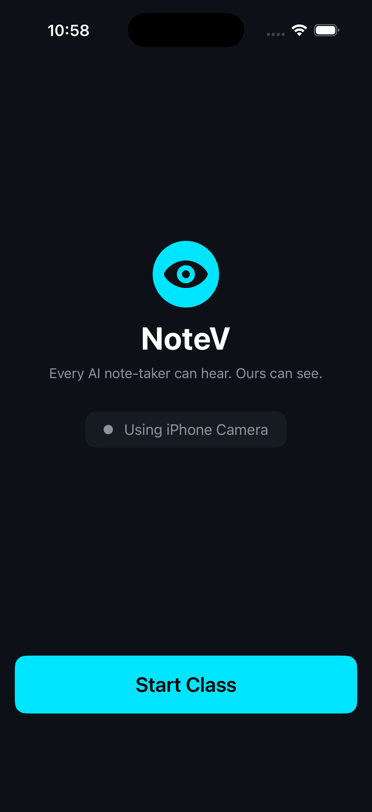
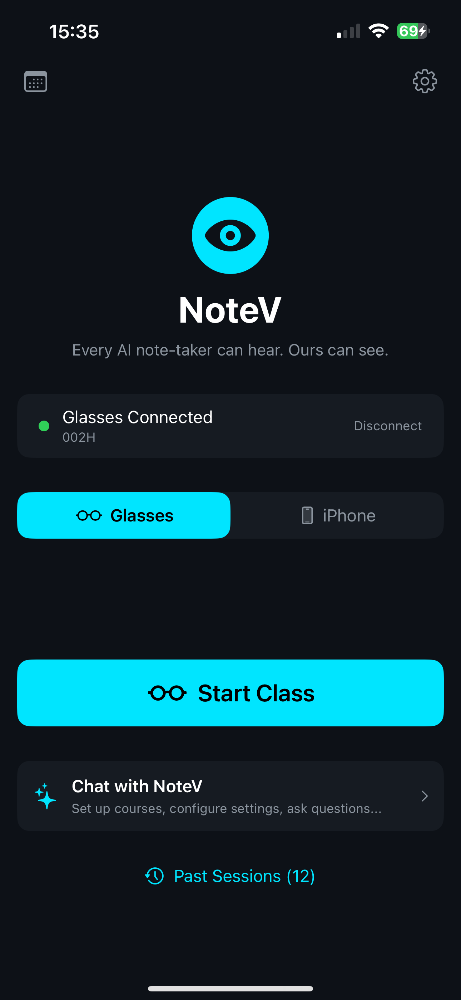
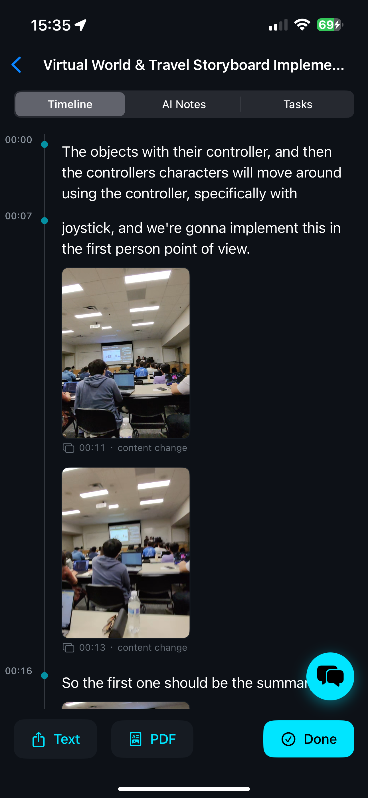
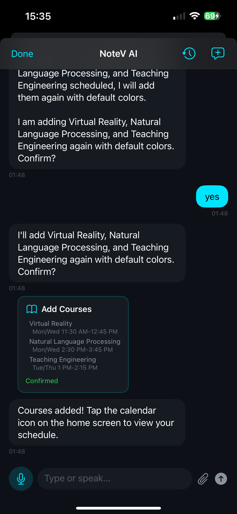
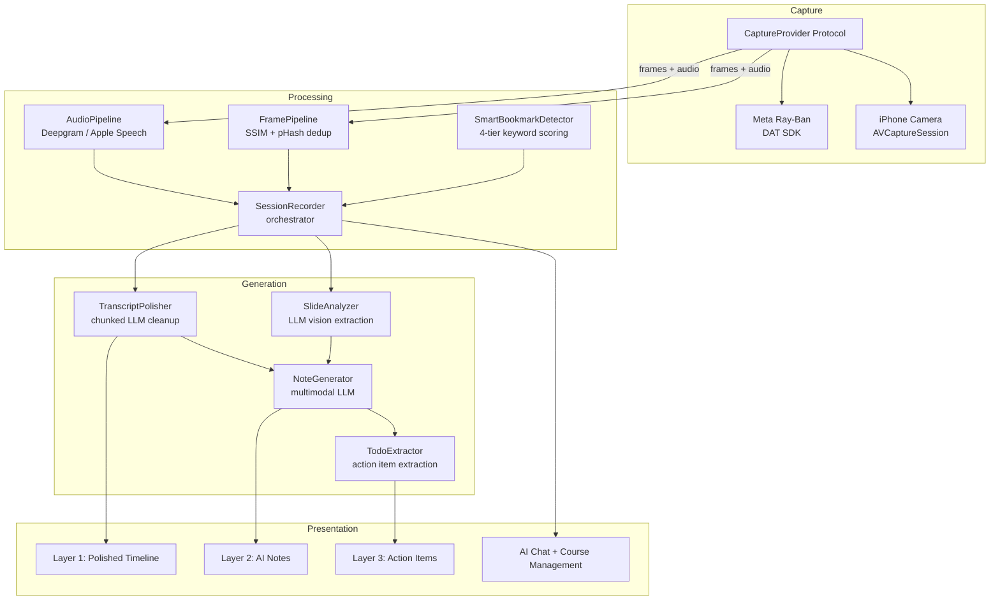

<h1 align="center">
  <br>
  
  <br>
  NoteV
  <br>
</h1>

<h3 align="center"><strong>Every AI note-taker can hear. Ours can see.</strong></h3>

<p align="center">
  AI classroom assistant for Meta Ray-Ban smart glasses.<br>
  Captures audio + visual content during lectures → generates structured multimodal notes.
</p>

<p align="center">
  <a href="#get-started-in-5-minutes">Quick Start</a> •
  <a href="#features">Features</a> •
  <a href="#architecture">Architecture</a> •
  <a href="#roadmap">Roadmap</a>
</p>

---

<p align="center">
  <strong>🎒 No smart glasses? No problem.</strong><br>
  NoteV works with just your iPhone camera — same full pipeline, no extra hardware needed.<br>
  Point your phone at the whiteboard and go.
</p>

---

<!--
TODO: Replace with demo video once recorded
[](YOUR_YOUTUBE_LINK)
-->

<p align="center">
  
  &nbsp;&nbsp;
  
  &nbsp;&nbsp;
  
</p>
<p align="center">
  <em>Home screen with Ray-Ban connected &nbsp;·&nbsp; Polished transcript timeline &nbsp;·&nbsp; AI chat with course setup</em>
</p>

## Get Started in 5 Minutes

**What you need:**
- Xcode 15+ on macOS
- A free [Deepgram API key](https://console.deepgram.com/) (for speech-to-text)
- Any one LLM API key: [Gemini](https://aistudio.google.com/apikey) (free tier) / [OpenAI](https://platform.openai.com/api-keys) / [Anthropic](https://console.anthropic.com/)
- An iPhone or iOS Simulator — **Meta Ray-Ban glasses are 100% optional**

```bash
git clone https://github.com/DearBobby9/NoteV_Glasses.git
cd NoteV_Glasses

# Set up API keys (gitignored — your keys stay local)
cp NoteV/Config/Secrets.xcconfig.example NoteV/Config/Secrets.xcconfig
# Edit Secrets.xcconfig — paste your Deepgram key

open NoteV.xcodeproj
# Select your device/simulator → Cmd+R
# On first launch: tap ⚙️ → select LLM provider → enter API key
```

## Features

### Three-Layer Output Pipeline

| Layer | What it does |
|-------|-------------|
| **Polished Timeline** | AI-cleaned transcript with inline images, bookmark highlights, and sticky section headers |
| **AI Notes** | Structured notes organized by slide transitions with timestamps and table of contents |
| **Action Items** | Extracted TODOs with categories, priorities, due dates → batch export to iOS Reminders & Calendar |

### Smart Recording

- **Dual capture** — Meta Ray-Ban glasses via DAT SDK, or iPhone back camera (automatic fallback)
- **Real-time STT** — Deepgram WebSocket streaming with KeepAlive and graceful shutdown
- **Smart bookmarks** — Auto-detects key moments ("this will be on the exam", "important") via 4-tier keyword taxonomy with confidence scoring
- **Frame intelligence** — 5s periodic sampling + SSIM change detection + pHash slide deduplication
- **Slide analysis** — LLM vision reads slide content (titles, bullets, formulas, diagrams) — not OCR

### AI Chat System

- **Unified chat** — Ask questions about your notes, set up courses, configure settings, create reminders — all through natural language
- **Voice input** — Deepgram-powered dictation
- **Action cards** — Confirmable UI buttons for adding courses, changing settings, creating reminders
- **Session context** — Chat has access to your transcript, notes, slides, and todos

### Course Management

- **Conversational setup** — Tell the AI your schedule naturally ("I have CS229 MWF 10am") — no forms
- **Auto-detection** — Detects which course you're in when recording starts
- **Weekly calendar** — iOS Calendar-style grid view with course blocks and live time indicator

### Export

- **Export Preview** — Review and edit action items before batch export (toggle Reminder vs Calendar Event, edit titles/dates/priorities)
- **PDF generation** — Formatted PDF with inline images and section timestamps
- **iOS Reminders** — Batch export to dedicated "NoteV Tasks" list with deep links back to session timestamps

## Architecture



## Tech Stack

| Component | Technology |
|-----------|-----------|
| Platform | iOS 17+ / Swift 6 / SwiftUI |
| Smart Glasses | Meta Ray-Ban Gen-2 (DAT SDK v0.4.0) |
| Speech-to-Text | Deepgram nova-3 via native WebSocket (primary) / Apple Speech (fallback) |
| LLM | OpenAI GPT-4o / Anthropic Claude / Google Gemini (configurable) |
| Native Frameworks | EventKit, PDFKit, Speech, AVFoundation |
| Storage | FileManager + JSON + JPEG (no CoreData) |

## Project Structure

```
NoteV/
├── App/              # Entry point, AppState (session lifecycle)
├── Capture/          # CaptureProvider protocol, Glasses + Phone providers
├── Processing/       # AudioPipeline, FramePipeline, SessionRecorder, SmartBookmarkDetector
├── NoteGeneration/   # NoteGenerator, TranscriptPolisher, TodoExtractor, SlideAnalyzer, PDFGenerator
├── Services/         # DeepgramService, LLMService, ReminderSyncService
├── Models/           # SessionData, TranscriptSegment, Bookmark, TodoItem, Course
├── Storage/          # SessionStore, CourseStore, ChatStore, ImageStore
├── Views/            # SwiftUI screens + reusable components
└── Config/           # NoteVConfig (all tunable params), xcconfig files
```

## Roadmap

- [ ] **Visual Q&A** — Tap any image in the timeline → ask the AI about that specific slide with surrounding transcript context
- [ ] **Smart Review Reminders** — Auto-generate review summaries before exams from cross-session notes, spaced repetition nudges
- [ ] **Cross-Session Course Intelligence** — Link sessions to courses, build knowledge graph across weeks
- [ ] **Multi-Language STT** — Support non-English lectures via Deepgram language params
- [ ] **Android Companion** — Extend beyond iOS for broader smart glasses adoption

Have an idea or want to contribute? [Open an issue](https://github.com/DearBobby9/NoteV_Glasses/issues) — feature requests and PRs are welcome.

## Known Limitations

- Glasses features require a physical iPhone (DAT SDK doesn't run in simulator)
- Apple Speech fallback has ~1 min recognition limit (auto-restarts)
- No permission pre-ask flow — iOS prompts on first camera/mic/speech use

## License

MIT License. See [LICENSE](LICENSE) for details.
