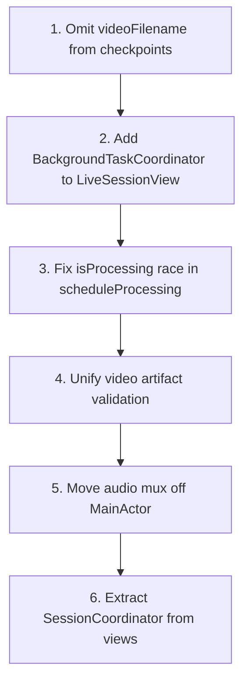

# Architecture Review — Capture Resilience & Post-Processing Pipeline

**Repository:** `/Users/alexhughes/Desktop/NoteV_Glasses`  
**Scope:** `SessionRecorder.swift`, `PostProcessingOrchestrator.swift`, `VideoRecorder.swift`, `VisualSampleProcessor.swift`, `BackgroundTaskCoordinator.swift`, `SessionData+Capture.swift`, `NoteGenerator.swift`, `LiveSessionView.swift`, `SessionResultView.swift`  
**Stack:** iOS 17+ / Swift 6 / SwiftUI — folder-based layers (`Capture/`, `Processing/`, `NoteGeneration/`, `Storage/`, `Views/`, `App/AppState`)  
**Date:** 2026-06-24

---

## Executive Summary

The capture resilience work is directionally sound: serial `DispatchQueue` ownership in `VideoRecorder`/`VisualSampleProcessor`, explicit drain ordering in `stopRecording()`, checkpointing, and `BackgroundTaskCoordinator` for post-processing show mature thinking about real-world failure modes.

However, an adversarial review finds **three critical integrity gaps** at the checkpoint ↔ MP4 boundary and background lifecycle, plus **MainActor work on the audio-mux hot path** that will degrade long glasses sessions. Layer boundaries are typical for a small SwiftUI app but violate strict VGV separation: views and orchestrators both mutate `AppState` and call `SessionStore` directly.

**Verdict: Fix 3 critical violations before merging.**

---

## Layer Separation

**Violations found: 6 (architectural — no Swift module enforcement, but clear responsibility leaks)**

| Location | Violation |
|----------|-----------|
| `LiveSessionView.swift:12-13,186-191` | **Presentation → Storage/Services:** View owns `CourseDetector` and `CourseStore`, runs course detection inline in `endSession()`. |
| `LiveSessionView.swift:201-205` | **Presentation → Processing:** View schedules post-processing via singleton orchestrator. |
| `SessionResultView.swift:32,525-610,612-628` | **Presentation → Storage/Generation:** View owns `SessionStore`, `PDFGenerator`, reprocess stage selection, and persistence. |
| `SessionResultView.swift:551-553,581-585` | **Presentation → Processing:** Cancel/reprocess wired directly to `PostProcessingOrchestrator.shared`. |
| `PostProcessingOrchestrator.swift:99-294` | **Processing → Presentation:** Orchestrator mutates `AppState` (`sessionStatus`, `currentSession`, `generatedNotes`, `extractedTodos`, `processingWarnings`) on every stage. |
| `SessionRecorder.swift:115-123,167-184,462-514` | **Processing → Presentation:** Recorder directly mutates `AppState` for live UI (transcript, warnings, frame count, bookmarks). |

**Clean files (within scope):**

- `VideoRecorder.swift` — self-contained AVFoundation writer; no UI imports.
- `VisualSampleProcessor.swift` — ingress fan-out only; no presentation coupling.
- `BackgroundTaskCoordinator.swift` — UIKit utility with no business logic.
- `SessionData+Capture.swift` — pure model helpers; no layer leaks.
- `NoteGenerator.swift` — generation layer only; depends on models + services, not SwiftUI.

**Intended dependency flow (from README):**

```
Capture → Processing (SessionRecorder) → Generation → Presentation
```

**Actual flow in changed code:**

```
Views ↔ AppState ↔ SessionRecorder / PostProcessingOrchestrator ↔ Storage / Services
```

`AppState` acts as a global state bag bridging all layers. Acceptable for MVP, but it prevents testing processing without UI and makes cancellation/re-entrancy harder to reason about.

---

## State Management Assessment

| Unit | Assessment | Findings |
|------|------------|----------|
| `AppState` | Correct pattern for app shell | Single `@MainActor ObservableObject`; session lifecycle enums are clear. |
| `SessionRecorder` | Issues found | `@MainActor ObservableObject` with 7+ concurrent `Task`s mutating `collectedFrames`, `collectedSegments`, `collectedBookmarks`. Isolation relies on implicit MainActor inheritance in child `Task {}` blocks — fragile if any collector is switched to `Task.detached` without `MainActor.run`. |
| `PostProcessingOrchestrator` | Issues found | Singleton with `isProcessing` flag + cancellable `activeTask`; re-entrancy race (see Critical #3). Stage state lives in `AppState.sessionStatus` instead of orchestrator-owned immutable state. |
| `LiveSessionView` | Issues found | `@State isEndingSession` is correct; business logic (course detect, post-process scheduling) belongs in a coordinator/ViewModel. |
| `SessionResultView` | Issues found | 720 lines mixing tabs, export, reprocess pipeline, Reminders sync — classic "Massive View" anti-pattern. |
| `NoteGenerator` | Correct | Stateless service; chunking via `SessionData.filtered(to:)` is clean. Side-effect log in `init` reads `SettingsManager.shared` (minor). |

---

## MainActor & Concurrency

### What works

- `SessionRecorder`, `PostProcessingOrchestrator`, `AppState` consistently `@MainActor`.
- Heavy frame extraction offloaded: `SessionFrameExtractor` uses `Task.detached` (`SessionFrameExtractor.swift:44-49`).
- `VideoRecorder` / `VisualSampleProcessor` use dedicated serial queues with `@unchecked Sendable` — appropriate for CMSampleBuffer ingress.
- `frameCollectorTask` correctly uses `Task.detached` + `MainActor.run` for UI updates (`SessionRecorder.swift:523-543`).

### Issues

| Severity | Location | Issue |
|----------|----------|-------|
| **Important** | `SessionRecorder.swift:441-453` | `startAudioMuxCollector` uses `Task {}` (MainActor). PCM resampling via `AudioResampler.resamplePCM16Mono` runs on MainActor for every audio chunk — will stutter UI on long sessions, especially glasses HFP. |
| **Important** | `SessionRecorder.swift:648-658` | Checkpoint loop: `flushRecordingPipeline()` + synchronous `sessionStore.save()` on MainActor every 30s. Large transcript/frame arrays → periodic UI hitches. |
| **Important** | `PostProcessingOrchestrator.swift:52-76` | Entire `process()` is `@MainActor`. Network awaits release the actor, but stage transitions, JSON saves, and file checks are serialized on main thread between awaits. |
| **Suggestion** | `SessionRecorder.swift:238-250` | `audioPipelineTask` / `framePipelineTask` use `Task.detached` but `audioMuxTask` / collectors use inheriting `Task {}` — inconsistent isolation strategy. |
| **Suggestion** | `GlassesCaptureProvider.swift:51` (related) | `nonisolated(unsafe) videoIngressProcessor` crosses MainActor boundary for DAT ingress; relies on processor's internal queue — document invariant or wrap in actor. |

---

## Async Lifecycle

### Recording start (`SessionRecorder.startRecording`)

```
selectProvider → start video recorder → startCapture → tee audio → detached pipeline tasks → collectors → checkpoint timer
```

**Strengths:**

- Fresh pipeline instances per session (AsyncStream one-shot correctness).
- Rollback on `startCapture` failure including `finishRecording()` cleanup (`SessionRecorder.swift:194-207`).
- `isRecording = true` only after successful capture start (`SessionRecorder.swift:210-211`).

**Issues:**

| Severity | Location | Issue |
|----------|----------|-------|
| **Suggestion** | `SessionRecorder.swift:158-160` | `onSamplingIntervalChanged` callback invoked from detached `FramePipeline` task without `@MainActor` annotation — currently safe because `VisualSampleProcessor.setSamplingInterval` dispatches to its queue, but implicit contract. |
| **Suggestion** | `SessionRecorder.swift:610-646` | `saveRecordingCheckpoint()` is synchronous and not `async` — callers in background `Task` blocks cannot await completion or handle save failures in UI. |

### Recording stop (`SessionRecorder.stopRecording`)

Documented shutdown sequence is well-designed:

```
cancel timer/checkpoint → stopCapture (finish frame stream) → await pipeline tasks → endAudio → await collectors → flush queues → finishRecording MP4 → assemble SessionData → save
```

**Strengths:**

- Explicit drain-before-finalize ordering prevents truncated MP4 (`SessionRecorder.swift:305-347`).
- Post-stop MP4 health check with mux sample count + audio track duration (`SessionRecorder.swift:324-339`).
- `deduplicateSegments` handles interim/final overlap (`SessionRecorder.swift:403-436`).

**Issues:**

| Severity | Location | Issue |
|----------|----------|-------|
| **Suggestion** | `SessionRecorder.swift:275-296` | `stopCapture()` calls `finishFrames()` inside provider while `framePipelineTask` may still be consuming — works today because `for await` drains buffered stream, but order is implicit and provider-coupled. |
| **Suggestion** | `SessionRecorder.swift:386-390` | `sessionId` cleared only partially — `sessionId` set in start but not nil'd in stop reset block (only `sessionStartTime`). Low risk but inconsistent. |

### Post-processing lifecycle

| Severity | Location | Issue |
|----------|----------|-------|
| **Critical** | `PostProcessingOrchestrator.swift:70-76,104-116` | `scheduleProcessing` cancels prior `activeTask` then immediately starts new `Task`. Cancelled task may still hold `isProcessing == true` until next stage boundary. New task hits `guard !isProcessing` and silently returns `"Processing already in progress"`. Reprocess/retry can no-op. |
| **Important** | `PostProcessingOrchestrator.swift:130-139` | Cancellation checked only **between stages**, not during long LLM/AVFoundation operations. User "Stop Processing" may wait minutes. |
| **Important** | `PostProcessingOrchestrator.swift:80-97` vs `303-318` | `cancelProcessing()` and `finishCancelled()` duplicate logic; `cancelProcessing` sets `isProcessing = false` but doesn't cancel in-flight stage work beyond `activeTask?.cancel()`. |

---

## Checkpoint vs MP4 Integrity

This is the highest-risk area for the resilience feature.

### How checkpoint works today

1. Every 30s (`NoteVConfig.LongSession.recordingCheckpointIntervalSeconds`): flush queues → save `SessionData` JSON.
2. Checkpoint metadata sets `videoFilename` when `videoRecorder != nil` (`SessionRecorder.swift:624`).
3. MP4 file exists on disk but **`AVAssetWriter.finishWriting()` has NOT run** — file is incomplete.

### How post-processing validates

```swift
// SessionData+Capture.swift:8-10
func hasRecoverableArtifacts(videoExistsOnDisk: Bool) -> Bool {
    !frames.isEmpty || !transcriptSegments.isEmpty || videoExistsOnDisk || metadata.videoFilename != nil
}
```

```swift
// PostProcessingOrchestrator.swift:145-147
let hasVideo = updatedSession.metadata.videoFilename != nil
    && FileManager.default.fileExists(atPath: videoURL.path)
```

### Integrity matrix

| Scenario | session.json | session.mp4 | Post-process behavior | User impact |
|----------|-------------|-------------|----------------------|-------------|
| Normal stop | Finalized metadata + transcript | `finishWriting` completed | Full pipeline | ✅ |
| Crash mid-recording (post-checkpoint) | `videoFilename` set, partial transcript/frames | **Unfinalized partial MP4** | `hasVideo == true` → transcript recovery attempted on corrupt file; Video tab may appear | ❌ |
| Crash before first checkpoint | May lack `videoFilename` | Partial or missing | Falls back to frames/transcript only | ⚠️ |
| Low disk skip | No video | No file | Warning shown; pipeline uses frames/transcript | ✅ |

| Severity | Location | Issue | Fix |
|----------|----------|-------|-----|
| **Critical** | `SessionRecorder.swift:624,633-641` | Checkpoint writes `videoFilename: "session.mp4"` while writer is still open. Crash leaves misleading metadata + corrupt MP4. | Add `metadata.videoRecordingState: .inProgress / .finalized / .failed` or omit `videoFilename` from checkpoints. Only set `videoFilename` in `stopRecording()` after successful `finishWriting`. |
| **Critical** | `SessionData+Capture.swift:8-10` | `metadata.videoFilename != nil` alone makes session "recoverable" even when file is missing or corrupt. | Require `videoExistsOnDisk && isPlayable(videoURL)` for video-based recovery. Remove standalone `videoFilename != nil` clause. |
| **Critical** | `SessionResultView.swift:38-43,119-120` | Video tab shown when `videoFilename != nil` AND file exists — partial checkpoint MP4 passes `fileExists` but fails playback/extraction. | Gate on finalized flag or probe `AVAsset.isPlayable` / `statusOfValue(forKey: "playable")`. |
| **Important** | `SessionRecorder.swift:611-646` | Checkpoint saves overwrite final session JSON during recording — if user force-quits during post-process of a *previous* session, unrelated; but if app relaunches and loads "in progress" session, stale `notes`/`polishedTranscript` from prior partial run could persist unless cleared. | Checkpoint should write to `session.checkpoint.json` or strip derived fields (`notes`, `polishedTranscript`, `todos`). |
| **Important** | `SessionData.swift:99-101` vs `SessionData+Capture.swift:8-10` | `canReprocess` and `hasRecoverableArtifacts` use different criteria for video eligibility — inconsistent UX for reprocess vs first-run pipeline. | Unify into one `VideoArtifactStatus` helper. |
| **Suggestion** | `SessionRecorder.swift:324-339` | MP4 health check runs only on normal stop, not after crash recovery. | On post-process `finalizing` stage, re-validate MP4 playability before transcript/frame extraction; clear `videoFilename` if corrupt. |

---

## Background Processing

| Path | Background task? | Assessment |
|------|------------------|------------|
| Post-processing (`PostProcessingOrchestrator.scheduleProcessing`) | ✅ `BackgroundTaskCoordinator.run` | Correct — extends execution for LLM/AV work. |
| Recording checkpoint (`LiveSessionView.swift:167-172`) | ❌ None | **Critical gap** — `scenePhase == .background` fires unstructured `Task` for flush + checkpoint without `beginBackgroundTask`. iOS may suspend before flush/checkpoint complete. |
| Glasses mic loss (`SessionRecorder.swift:675-681`) | ❌ None | Same risk — flush + checkpoint on route change without background task extension. |
| Checkpoint timer (foreground) | N/A | Runs while app active — OK. |

| Severity | Location | Issue | Fix |
|----------|----------|-------|-----|
| **Critical** | `LiveSessionView.swift:167-172` | No `BackgroundTaskCoordinator` wrapper for recording flush/checkpoint on background. | Wrap in `BackgroundTaskCoordinator.run(named: "NoteV.RecordingCheckpoint") { await flush; save }`. |
| **Important** | `BackgroundTaskCoordinator.swift:8-27` | Expiration handler ends task but **does not cancel** in-flight operation — work continues unsuspended without extension. | Pass cancellation token; on expiration, set flag so flush/save can bail gracefully. |
| **Suggestion** | Recording path generally | Post-processing gets background time; recording resilience does not — asymmetric protection. | Extract shared `RecordingResilienceCoordinator` used by checkpoint timer, scenePhase, and mic-loss handler. |

---

## Dependency Direction

**Direction violations: 0 circular module dependencies** (single app target), but **3 reverse-flow patterns:**

1. **Views → Processing singletons** — `PostProcessingOrchestrator.shared` called from views instead of injection through `AppState` or coordinator.
2. **Processing → AppState** — orchestrators push state up into presentation layer rather than exposing async results that views observe.
3. **Models → implicit video contract** — `hasRecoverableArtifacts` conflates metadata intent with disk reality.

**Clean dependencies:**

- `NoteGenerator` → `PromptBuilder`, `LLMService`, `NoteParser`, `SessionData` ✅
- `VisualSampleProcessor` → `VideoRecorder` (optional) ✅
- `SessionRecorder` → `CaptureManager`, pipelines, stores ✅ (except AppState coupling)

---

## Package Structure

Single iOS app target — no SPM packages. Folder layout matches README.

| Area | Status | Notes |
|------|--------|-------|
| `Processing/` | Complete | New resilience types fit here. |
| `Utilities/BackgroundTaskCoordinator.swift` | Complete | Consider `Processing/` or `App/` instead of `Utilities/`. |
| `Models/SessionData+Capture.swift` | Complete | Extension file pattern is fine. |
| Tests | Partial | `CaptureResilienceTests` covers config/chunking; **no tests** for checkpoint/MP4 integrity, stop ordering, or orchestrator cancellation. |

---

## Findings Summary

### Critical (fix before merge)

1. **Checkpoint advertises finalized video before MP4 is sealed** — `SessionRecorder.saveRecordingCheckpoint` sets `videoFilename` while `AVAssetWriter` is still open; crash produces corrupt MP4 + misleading metadata.
2. **Background recording flush lacks UIBackgroundTask** — `LiveSessionView` scenePhase handler can be interrupted before flush/checkpoint persist.
3. **Post-processing re-schedule race** — `scheduleProcessing` cancel + new task can hit `isProcessing` guard and silently skip reprocess.

### Important (fix soon)

4. **Audio mux resampling on MainActor** — `startAudioMuxCollector` blocks UI during PCM resample.
5. **Synchronous checkpoint save on MainActor every 30s** — jank risk for long sessions.
6. **`hasRecoverableArtifacts` / `canReprocess` video criteria inconsistent** — partial/corrupt video treated as recoverable.
7. **Cancellation only between post-processing stages** — "Stop Processing" feels unresponsive.
8. **Checkpoint overwrites session JSON** — may preserve stale derived fields from prior runs.
9. **Presentation layer owns orchestration** — views schedule/cancel processing, detect courses, generate PDFs.

### Suggestion (improvements)

10. Introduce `SessionCoordinator` / `@MainActor` ViewModel between views and `SessionRecorder`/`PostProcessingOrchestrator`.
11. Add `VideoArtifactStatus` enum on `SessionMetadata` (`.none`, `.recording`, `.finalized`, `.failed`).
12. Move audio mux + checkpoint I/O to detached tasks with actor-isolated collector snapshots.
13. Write checkpoint to separate file (`checkpoint.json`) to avoid clobbering finalized session state.
14. Extend `BackgroundTaskCoordinator` expiration to cooperative cancellation.
15. Add integration tests: stop ordering, checkpoint without `videoFilename`, corrupt MP4 recovery path, orchestrator re-schedule after cancel.
16. Unify `PostProcessingOrchestrator` cancellation paths (`cancelProcessing` / `finishCancelled`).

---

## Recommended Fix Order



---

## Verdict

**Fix 3 critical violations before merging.**

The pipeline design (tee → mux → flush → finalize, staged post-processing, chunked note generation) is solid engineering. The gaps are at the **metadata/disk contract boundary** and **background lifecycle**, where silent data loss or corrupt recovery paths are most likely in production FANG-scale usage (90-minute lectures, app backgrounding, LTE drops, force-quit).
