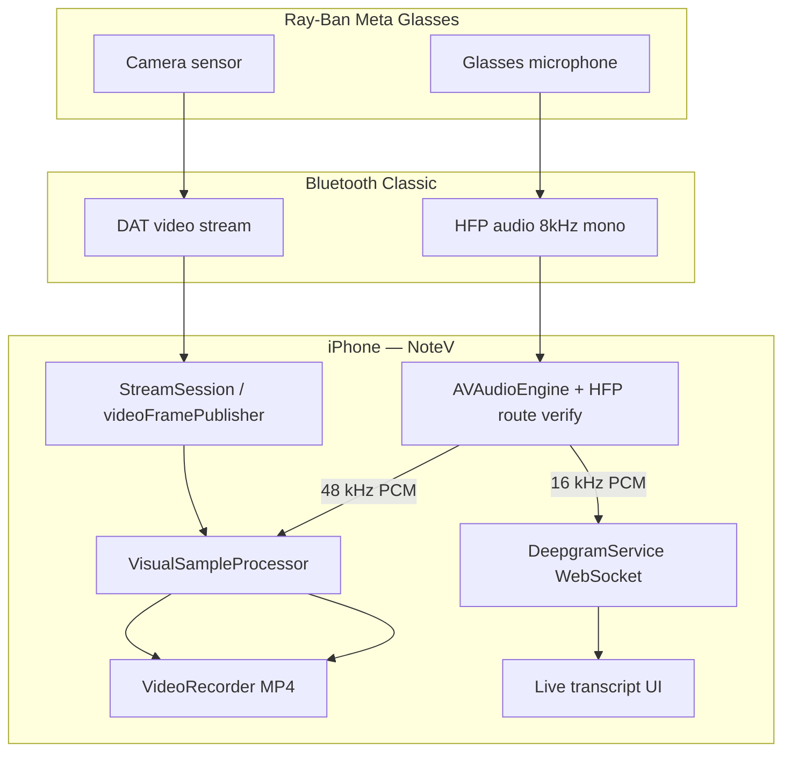

## Meta DAT Glasses Video + Audio Streaming — Research Plan

## Overview

NoteV captures **video from Meta Ray-Ban glasses via the DAT SDK** and **audio from the glasses microphone over Bluetooth HFP**, then **processes transcription on the iPhone** using Deepgram (not on-glasses STT, not the iPhone built-in mic when glasses are selected).

This plan documents **how to research Meta's official docs**, what they say about simultaneous video and audio streaming, how that maps to NoteV's current architecture, and what to validate or change next.

**Key clarification (user intent):**

| Layer | Source | Processing |
|-------|--------|------------|
| Video | Glasses → DAT `StreamSession` → phone | `VisualSampleProcessor` → MP4 + throttled frames |
| Audio | Glasses mic → Bluetooth HFP → phone | `AVAudioEngine` → Deepgram STT + MP4 AAC mux |
| STT | — | **On phone** via Deepgram WebSocket (existing service) |

"Transcribe on the phone" means **phone-side STT processing**, not **iPhone microphone capture**.

## Problem Statement / Motivation

Recent confusion mixed up two separate concerns:

1. **Where audio is captured** — glasses mic vs iPhone mic
2. **Where STT runs** — Deepgram on phone vs Apple Speech fallback vs on-glasses

Without a clear research baseline from Meta docs, it's easy to implement the wrong split (e.g. routing all audio through `PhoneMicrophoneProvider` when the user still wants glasses HFP input).

Meta's DAT SDK is a moving target (0.4.0 in NoteV today; 0.7.0 current with `DeviceSession` + `Stream` rename). Official docs must be the source of truth for what is and isn't supported.

## Research Decision

**External research required** — high-risk external API (Meta DAT), personal audio data, and documented platform constraints (Bluetooth Classic bandwidth, HFP ordering).

Local codebase already implements the likely-correct split; research validates assumptions and surfaces doc-driven fixes (especially HFP-before-stream ordering).

## How to Research Meta Docs (Step-by-Step)

### Phase 1 — Bookmark the doc set

Start at the developer center and read in this order:

| # | Doc | URL | What to extract |
|---|-----|-----|-----------------|
| 1 | Integration overview | https://wearables.developer.meta.com/docs/develop/dat/build-overview/ | Video vs audio transport split |
| 2 | iOS integration | https://wearables.developer.meta.com/docs/develop/dat/build-integration-ios/ | SPM setup, bandwidth limits, App Store constraints |
| 3 | **Microphones & speakers** | https://wearables.developer.meta.com/docs/develop/dat/microphones-and-speakers/ | HFP setup, ordering, sample rate |
| 4 | Permissions | https://wearables.developer.meta.com/docs/develop/dat/permissions-requests/ | Camera (DAT) vs mic (iOS platform) |
| 5 | Session lifecycle | https://wearables.developer.meta.com/docs/develop/dat/lifecycle-events/ | Pause/stop/disconnect behavior |
| 6 | Known issues | https://wearables.developer.meta.com/docs/develop/dat/knownissues/ | Reconfigure limits, hinge close |
| 7 | Version dependencies | https://wearables.developer.meta.com/docs/develop/dat/version-dependencies/ | Meta AI app + firmware minimums |
| 8 | LLM index (full) | https://wearables.developer.meta.com/llms.txt?full=true | Machine-readable doc map for follow-up queries |

### Phase 2 — Read API reference for NoteV's SDK version (0.4.0)

| Type | URL |
|------|-----|
| `StreamSession` | https://wearables.developer.meta.com/docs/reference/ios_swift/dat/0.4/mwdatcamera_streamsession |
| `StreamSessionConfig` | https://wearables.developer.meta.com/docs/reference/ios_swift/dat/0.4/mwdatcamera_streamsessionconfig |
| iOS API index (0.4) | https://wearables.developer.meta.com/docs/reference/ios_swift/dat/0.4/ |

**Checklist when reading `StreamSession` reference:**

- [ ] List every publisher: confirm `videoFramePublisher`, `photoDataPublisher`, `statePublisher`, `errorPublisher`
- [ ] Confirm **no** `audioFramePublisher`, `audioPublisher`, or audio config on `StreamSessionConfig`
- [ ] Note `VideoCodec` behavior (`.raw` = foreground-only frames)
- [ ] Note valid `frameRate` values: 2, 7, 15, 24, 30
- [ ] Note resolution ladder: `.high` 720×1280, `.medium` 504×896, `.low` 360×640

### Phase 3 — Study official sample code

| Resource | URL | Focus |
|----------|-----|-------|
| iOS SDK repo | https://github.com/facebook/meta-wearables-dat-ios | SPM products: `MWDATCore`, `MWDATCamera` |
| CameraAccess sample | https://github.com/facebook/meta-wearables-dat-ios/tree/main/samples | Registration, streaming, photo capture |
| Camera streaming skill | https://github.com/facebook/meta-wearables-dat-ios/blob/main/plugins/mwdat-ios/skills/camera-streaming/SKILL.md | Minimal streaming pattern |
| GitHub issue #135 | https://github.com/facebook/meta-wearables-dat-ios/issues/135 | Maintainer confirmation: no DAT audio API |

**Diff exercise:** Compare CameraAccess sample's stream + audio setup against `NoteV/Capture/GlassesCaptureProvider.swift`.

### Phase 4 — Cross-check NoteV codebase

| File | What to verify |
|------|----------------|
| `NoteV/Capture/GlassesCaptureProvider.swift` | DAT video + HFP audio tap; startup order |
| `NoteV/Processing/AudioPipeline.swift` | Deepgram-only live STT (no cellular Apple Speech fallback) |
| `NoteV/Processing/SessionRecorder.swift` | Uses `provider.audioStream`; wires glasses vs phone source |
| `NoteV/Processing/VisualSampleProcessor.swift` | Video PTS vs audio wall-clock timestamps |
| `NoteV/Config/NoteVConfig.swift` | `Audio.sampleRate` (16 kHz STT), `Audio.muxSampleRate` (48 kHz MP4) |
| `docs/plan/2026-06-24-feat-video-first-frame-extraction-plan.md` | Prior v1 decisions on glasses audio mux |

### Phase 5 — Device validation matrix

Run on **physical Ray-Ban Meta glasses** (not Simulator):

| Test | Pass criteria |
|------|---------------|
| Route check at start | `AVAudioSession.currentRoute.inputs` contains `.bluetoothHFP` |
| Source isolation | Speak near glasses, phone in pocket → transcript matches glasses speech |
| Concurrent load | Video frames + HFP audio + Deepgram on LTE without silent mic fallback |
| MP4 playback | AAC track audible; not 144-byte corrupt export |
| Mid-session disconnect | Glasses removed → visible UX (not silent phone-mic switch) |
| Head alignment | First transcript segment within ±500ms of first video frame bookmark |

## Research Findings (Consolidated)

### Video — DAT SDK native stream ✅

Meta streams **video only** through `StreamSession`:

```
StreamSession.start()
  → videoFramePublisher → VideoFrame.sampleBuffer
  → photoDataPublisher  → still capture
  → statePublisher      → .streaming / .stopped / …
  → errorPublisher      → hingesClosed, permissionDenied, …
```

NoteV's `GlassesCaptureProvider` usage aligns with official docs.

### Audio — NOT in DAT SDK; HFP only ✅

Official position ([build overview](https://wearables.developer.meta.com/docs/develop/dat/build-overview/)):

> *"Use mobile platform functions… To use the device's microphones for input, use HFP (Hands-Free Profile). Audio is streamed as 8 kHz mono from the device to your app."*

| Profile | Direction | Quality |
|---------|-----------|---------|
| HFP | Bidirectional | **8 kHz mono** — glasses mic capture |
| A2DP | Output only | 44.1/48 kHz stereo — media playback |

**There is no DAT audio stream API.** `StreamSessionConfig` has zero audio flags. GitHub issue #135 confirms no dedicated voice path in SDK.

NoteV's `AVAudioEngine` + `.allowBluetoothHFP` path is **architecturally correct** for "glasses audio, phone-processed."

### Critical doc constraint — HFP before stream ⚠️

From [Microphones and speakers](https://wearables.developer.meta.com/docs/develop/dat/microphones-and-speakers/):

> *"When using HFP with a DAT camera stream, the HFP microphone must be fully configured before the stream starts."*

**NoteV today does the reverse** in `GlassesCaptureProvider.startCapture()`:

1. `streamSession.start()` → wait for `.streaming`
2. Then `configureAudioEngine()` + `audioEngine.start()`

This is a documented silent-failure risk. **Recommended fix:** reorder to configure HFP first, verify route (~2 s settle), then start DAT stream.

### Permissions split

| Permission | Mechanism | NoteV today |
|------------|-----------|-------------|
| Glasses camera | DAT `.camera` via Meta AI deeplink | ✅ `GlassesCaptureProvider` |
| Glasses mic | iOS `NSMicrophoneUsageDescription` + HFP routing | ⚠️ No explicit HFP route verification |
| Speech recognition | iOS Speech framework | Required even for Deepgram-only path — unnecessary friction |

### Bandwidth & firmware

- Video + HFP share **Bluetooth Classic** bandwidth; SDK auto-degrades resolution then FPS (floor 15 fps).
- SDK 0.4.0 minimums: Meta AI **V254**, glasses firmware **V20**.
- SDK 0.7.0 minimums: Meta AI **V272**, firmware **V125** (if upgrading).

### Architecture diagram (target state)



## Proposed Solution (Post-Research)

### Keep (validated by Meta docs)

- DAT `StreamSession` for glasses video
- HFP `AVAudioEngine` for glasses mic capture
- Deepgram on phone for live STT (remove any Apple Speech cellular fallback)
- Post-stop `SessionTranscriptExtractor` MP4 fallback

### Change (doc-driven)

1. **Reorder startup:** HFP configure → route verify → DAT `start()`
2. **Add HFP preflight:** Block or warn if `.bluetoothHFP` not in `currentRoute.inputs`
3. **Route monitoring:** `AVAudioSession.routeChangeNotification` → banner if mic source changes
4. **UX copy:** "Video from glasses · Audio from glasses mic · Transcription on iPhone"
5. **Remove `PhoneMicrophoneProvider` always-on path** if still present — wrong for glasses sessions
6. **Decouple Speech permission** from Deepgram-only start gate

### Do NOT pursue (unless Meta docs change)

- Native DAT audio publisher (does not exist in 0.4–0.7)
- On-glasses STT
- iPhone built-in mic when user selected glasses capture source

## Technical Considerations

### Audio sample rate mismatch

HFP delivers **8 kHz mono** from glasses; NoteV converts to **16 kHz** (Deepgram) and **48 kHz** (MP4 AAC). Resampling is required and already implemented — validate quality on device.

### Timestamp sync

- Video: CMSampleBuffer PTS via `VisualSampleProcessor`
- Audio: wall-clock `Date().timeIntervalSince(sessionStartTime)` in HFP tap
- v1 tolerance: ±500ms (documented in prior plans); fix in follow-up if field tests fail

### Deepgram on LTE

Separate from Meta docs but affects "phone-processed" UX. Live WebSocket may fail on cellular; MP4 REST fallback covers post-stop. Surface failures in UI during recording.

### SDK upgrade path (0.4 → 0.7)

| 0.4 (today) | 0.7 |
|-------------|-----|
| `StreamSession(config:deviceSelector:)` | `DeviceSession` + `addStream(config:)` |
| `StreamSessionConfig` | `StreamConfiguration` |
| `await streamSession.start()` | `deviceSession.start()` then `stream.start()` |

Research spike should note migration cost before upgrading.

## Acceptance Criteria

### Research complete when:

- [ ] All Phase 1–3 docs read; findings recorded in this plan or a linked `docs/research/` note
- [ ] Confirmed: no DAT native audio API for NoteV's SDK version
- [ ] CameraAccess sample compared to `GlassesCaptureProvider.swift`; delta list written
- [ ] HFP-before-stream reorder decision made (implement or document why not)
- [ ] Device validation matrix (Phase 5) executed on physical glasses; results logged

### "Glasses audio, phone-processed" working when:

- [ ] `AVAudioSession.currentRoute` shows HFP/glasses at session start
- [ ] Live Deepgram transcript matches speech at glasses (control test: phone silent)
- [ ] MP4 AAC track contains glasses audio (audible playback)
- [ ] UI states audio source explicitly; no silent fallback to phone mic
- [ ] Deepgram always used for live STT (no cellular Apple Speech fallback)
- [ ] Post-stop transcript recovery from MP4 when live STT gaps occur

## Success Metrics

| Metric | Target |
|--------|--------|
| HFP route active at session start | >95% of glasses sessions on supported firmware |
| Live transcript latency (first segment) | ≤10s Wi‑Fi, ≤20s LTE after speech |
| Wrong mic source (phone mic when glasses selected) | 0% undetected — must warn or block |
| MP4 audio present | >95% sessions with audible AAC track |

## Dependencies & Risks

| Risk | Mitigation |
|------|------------|
| HFP not active despite glasses connected | Preflight route check + user guidance |
| HFP-after-stream ordering | Reorder per Meta docs |
| BT bandwidth contention (video + audio) | Accept SDK adaptive degrade; consider lower initial resolution |
| Deepgram LTE reliability | Buffer + MP4 fallback + UI warning |
| DAT SDK version drift | Pin 0.4 until migration spike complete |
| App Store (ExternalAccessory) | Already known DAT limitation — dev/test distribution only |

## User Flow Gaps (from flow analysis)

| Flow | Gap |
|------|-----|
| Start session | No HFP preflight; misleading "transcribe on phone" copy |
| Live session | No audio-source indicator; Deepgram failures invisible |
| Mid-session | No route-change handling when glasses removed |
| Stop / post-process | Empty live transcript with good MP4 — no explanation shown |

## References & Research

### NoteV codebase

- `NoteV/Capture/GlassesCaptureProvider.swift` — DAT video + HFP audio
- `NoteV/Capture/PhoneCaptureProvider.swift` — phone camera + iPhone mic
- `NoteV/Processing/SessionRecorder.swift` — session orchestration
- `NoteV/Processing/AudioPipeline.swift` — Deepgram live STT
- `NoteV/Services/DeepgramService.swift` — WebSocket STT
- `docs/plan/2026-06-24-feat-video-first-frame-extraction-plan.md` — prior video-first architecture

### Meta official docs

- [DAT home](https://wearables.developer.meta.com/docs/develop/dat/)
- [iOS integration](https://wearables.developer.meta.com/docs/develop/dat/build-integration-ios/)
- [Microphones & speakers (HFP)](https://wearables.developer.meta.com/docs/develop/dat/microphones-and-speakers/)
- [StreamSession 0.4 API](https://wearables.developer.meta.com/docs/reference/ios_swift/dat/0.4/mwdatcamera_streamsession)
- [Permissions](https://wearables.developer.meta.com/docs/develop/dat/permissions-requests/)
- [Known issues](https://wearables.developer.meta.com/docs/develop/dat/knownissues/)

### Meta samples & community

- [meta-wearables-dat-ios](https://github.com/facebook/meta-wearables-dat-ios)
- [CameraAccess sample](https://github.com/facebook/meta-wearables-dat-ios/tree/main/samples)
- [Issue #135 — no DAT audio API](https://github.com/facebook/meta-wearables-dat-ios/issues/135)

### Apple (supporting)

- [AVAudioSession route monitoring](https://developer.apple.com/documentation/avfaudio/avaudiosession/routechangenotification)
- [AVAssetWriter](https://developer.apple.com/documentation/avfoundation/avassetwriter)

## Implementation Follow-Up (Out of Scope for This Research Plan)

After research validation, a separate **implementation plan** should cover:

1. HFP-first startup reorder in `GlassesCaptureProvider.swift`
2. `AudioRouteMonitor` helper (preflight + live banner)
3. UX copy updates in `StartSessionView` / `LiveSessionView`
4. Remove cellular Apple Speech fallback (keep Deepgram-only)
5. Device test log template for Phase 5 matrix

## Open Questions

- [ ] Does Meta AI app need to be in a specific state for HFP to bind to glasses during DAT stream?
- [ ] Oakley Meta Vanguard audio routing differences vs Ray-Ban Gen 2?
- [ ] Is wideband HFP (16 kHz) available on any supported firmware, or always 8 kHz narrowband?
- [ ] When to schedule SDK 0.4 → 0.7 migration?
