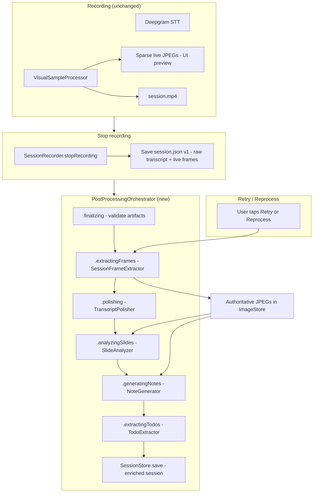

> **Brainstorm source:** [2026-06-24-post-processing-pipeline-brainstorm-doc.md](../brainstorm/2026-06-24-post-processing-pipeline-brainstorm-doc.md)

## feat: post-recording processing pipeline with MP4 frame extraction — Standard

## Overview

Introduce a **unified post-recording processing pipeline** for NoteV that runs after the user stops a session. The pipeline shows **staged progress** (spinner + stage label), **extracts authoritative frames from `session.mp4`** using adaptive transcript-density and visual change detection, then runs the **existing LLM chain** unchanged (`TranscriptPolisher` → `SlideAnalyzer` → `NoteGenerator` → `TodoExtractor`).

During recording, nothing changes: **live Deepgram STT** and **sparse live frame preview** via `VisualSampleProcessor` remain as-is. MP4 is never sent to any LLM — only extracted JPEGs feed vision calls, bounded by extraction budget + existing pHash dedup.

## Problem Statement / Motivation

Video-first capture (`feat/video-first-frame-extraction`) saves full MP4 + sparse live JPEGs, but **AI analysis still uses the sparse live frame set** (~1 frame / 5s). Fast lectures and rapid slide changes are under-sampled. Post-stop processing is also **duplicated and inconsistent**:

- `LiveSessionView.endSession()` runs polish → slides → notes → todos inline
- `SessionResultView.retryGeneration()` skips slide analysis and frame extraction entirely
- Progress UI is **per-tab** — slide analysis stage invisible on Timeline tab
- No **Reprocess** for successful sessions; no visible **Finalize / Extract frames** stages

Users need a clear "processing your lecture" experience with **full retry/reprocess** from disk without re-recording.

## Proposed Solution

### Architecture



### Key design decisions (locked for v1)

| Decision | Choice | Rationale |
|----------|--------|-----------|
| AI pipeline | **Reuse existing services** — no LLM contract changes | Brainstorm confirmed; minimizes risk |
| Authoritative frames | **Replace** periodic live JPEGs post-extraction; **keep** `bookmark_*.jpg` | One source of truth for slides; bookmarks are user-triggered |
| Extraction budget | **250** candidate frames max pre-dedup | ~40 vision calls post-dedup unchanged |
| Adaptive density | Transcript WPM windows + visual scene-change scan | User chose both triggers |
| Base sampling | 5s periodic + tighter intervals in dense windows (min 1s) | Aligns with current `NoteVConfig.Frame` |
| MP4 missing | Skip extraction; warn user; continue on live frames | Graceful degradation |
| Extraction failure | Fallback to live frames + inline warning | Availability over perfect quality |
| Reprocess scope | Full pipeline stages 2–6 | User-selected in brainstorm |
| Processing location | On-device only | v1 scope |
| Glasses timestamp drift | Accept ±500ms for transcript-window mapping | Document; fix audio PTS in follow-up if needed |
| Course tag race | Merge `courseId` from `AppState` at final save | Fix known bug during orchestrator work |

### PostProcessingOrchestrator contract

New `NoteV/Processing/PostProcessingOrchestrator.swift`:

```swift
enum PostProcessingStage: Equatable {
    case finalizing
    case extractingFrames
    case polishing
    case analyzingSlides
    case generatingNotes
    case extractingTodos
}

struct PostProcessingResult {
    let session: SessionData
    let warnings: [String]   // non-fatal stage failures
    let failedStage: PostProcessingStage?
}

final class PostProcessingOrchestrator {
    func process(
        session: SessionData,
        fromStage: PostProcessingStage = .finalizing,
        onStageChange: @MainActor (PostProcessingStage) -> Void
    ) async throws -> PostProcessingResult
}
```

- **Single entry point** for `LiveSessionView`, `SessionResultView` retry, and Reprocess button
- **Incremental persistence:** save after polish, slides, notes (crash recovery → partial session browsable)
- **Idempotent:** reprocess clears stale `notes`, `todos`, `slideAnalysis`, PDF cache before re-run
- **Guard:** ignore concurrent `process()` calls while `isProcessing == true`

### SessionFrameExtractor (new)

`NoteV/Processing/SessionFrameExtractor.swift`:

1. Load `session.mp4` via `SessionStore.videoURL(for:)`
2. Build **extraction timestamp list:**
   - Uniform anchors every 5s across duration
   - **Transcript-density windows:** segments with WPM > threshold → add 1s-spaced seeks inside window
   - **Scene-change scan:** coarse pass every 2s using same pixel-diff as `FramePipeline`; add seeks at change boundaries
3. Merge, sort, dedupe timestamps within 0.5s
4. Cap at `NoteVConfig.FrameExtraction.maxCandidateFrames` (250)
5. For each timestamp: `AVAssetImageGenerator.copyCGImage(at:)` → JPEG → `ImageStore.saveImage`
6. Replace `session.frames[]` with new `TimestampedFrame` list (preserve bookmarks in `session.bookmarks` + files)
7. Return updated `SessionData`

Reuse `FramePipeline.computePixelDifference` logic via package-internal helper or shared `FrameChangeDetector` utility (extract from `FramePipeline` — minimal refactor).

### SessionStatus additions

Extend `AppState.SessionStatus`:

```swift
case finalizing           // NEW — after stop, before extraction
case extractingFrames     // NEW — MP4 frame extraction
// existing: polishing, analyzingSlides, generatingNotes, extractingTodos, complete, error
```

### UI changes

| View | Change |
|------|--------|
| `SessionResultView` | **Global processing banner** above tabs — stage label for all statuses |
| `SessionResultView` | **Reprocess** button in action bar (complete sessions with MP4 or frames) |
| `SessionResultView` | Fix `retryGeneration()` → delegate to orchestrator (full pipeline) |
| `LiveSessionView` | Replace inline post-stop `Task` with orchestrator call |
| `LiveSessionView` | Disable **Done** while processing (or confirm dialog) |
| All result tabs | Show same progress banner during `.analyzingSlides` / `.extractingFrames` (fix Timeline gap) |

## Technical Considerations

### Timestamp alignment

- Extraction seeks use **session-relative seconds** (same origin as `VisualSampleProcessor.sessionTimestamp`)
- Map transcript segment `startTime` / `endTime` to extraction windows
- `AVAssetImageGenerator.requestedTimeToleranceBefore/After` = `.zero` for accuracy; accept slower extraction

### API cost controls

| Control | Value | Location |
|---------|-------|----------|
| Max extraction candidates | 250 | `NoteVConfig.FrameExtraction.maxCandidateFrames` |
| Max unique slides (vision LLM) | 40 | existing `NoteVConfig.SlideAnalysis.maxUniqueSlides` |
| Max frames in note prompt | 20 | existing `NoteVConfig.NoteGeneration.maxFramesInPrompt` |
| pHash dedup | unchanged | `FrameDeduplicator` |
| Slide concurrency | 3 | existing `SlideAnalyzer` |

Typical 60-min lecture: ~250 candidates → ~30–40 unique slides after dedup → same vision cost envelope as today.

### Performance

- Frame extraction on-device: budget 30–90s for 60-min MP4 (coarse scan + selective seeks)
- Run extraction off main thread; publish stage updates on `@MainActor`
- Consider `Task.detached(priority: .userInitiated)` for extraction pass

### Security / privacy

- No change: MP4 and JPEGs stay in app sandbox; LLM receives JPEGs only

### Dependency

- Requires `feat/video-first-frame-extraction` merged or checked out — needs `session.mp4`, `VisualSampleProcessor` PTS timebase, `SessionStore.videoURL(for:)`

## Implementation Plan (3 PRs)

### PR 1 — Orchestrator + status model (~350–450 LOC)

**Depends on:** video-first branch

- [ ] Add `PostProcessingStage` enum + `PostProcessingOrchestrator`
- [ ] Extend `SessionStatus` with `.finalizing`, `.extractingFrames`
- [ ] Wire orchestrator stages 3–6 (polish → slides → notes → todos) — **no extraction yet**; pass through existing `session.frames`
- [ ] Replace `LiveSessionView.endSession()` inline Task with orchestrator
- [ ] Replace `SessionResultView.retryGeneration()` with orchestrator (includes slides — fixes parity bug)
- [ ] Add global processing banner component `ProcessingStageBanner.swift`
- [ ] Fix course tag merge at final save
- [ ] Incremental `SessionStore.save()` after each stage
- [ ] Guard concurrent processing; disable Done during pipeline
- [ ] Tests: orchestrator stage order, config skip flags, course tag persistence

### PR 2 — SessionFrameExtractor (~400–550 LOC)

**Depends on:** PR 1

- [ ] Add `NoteVConfig.FrameExtraction` (budget, WPM threshold, min interval, coarse scan interval)
- [ ] Add `TranscriptDensityAnalyzer` — compute words/minute windows from `transcriptSegments`
- [ ] Extract shared change-detection helper from `FramePipeline` (or duplicate minimally for v1)
- [ ] Implement `SessionFrameExtractor.extract(session:videoURL:) async throws -> SessionData`
- [ ] Wire orchestrator stage 2; fallback to live frames on failure
- [ ] Replace periodic live frames in `session.frames`; preserve `bookmark_*.jpg`
- [ ] Tests: timestamp list generation, budget cap, WPM window expansion, mock MP4 fixture extraction

### PR 3 — Reprocess UX + hardening (~200–300 LOC)

**Depends on:** PR 2

- [ ] Add **Reprocess** button on `SessionResultView` for `.complete` sessions
- [ ] Reprocess clears notes/todos/slideAnalysis/PDF cache before orchestrator run
- [ ] MP4-less sessions: Reprocess runs LLM-only with label "No video — reprocessing notes from existing frames"
- [ ] Surface non-fatal stage warnings in banner (extraction fallback, polish skip, etc.)
- [ ] Session list badge for incomplete sessions (no notes, has raw transcript)
- [ ] Manual test matrix on device (phone + glasses)

### Files touched (expected)

```
NoteV/Processing/PostProcessingOrchestrator.swift     (new — PR1)
NoteV/Processing/SessionFrameExtractor.swift          (new — PR2)
NoteV/Processing/TranscriptDensityAnalyzer.swift        (new — PR2)
NoteV/Processing/FramePipeline.swift                    (extract change-detection helper — PR2)
NoteV/App/AppState.swift                                (SessionStatus — PR1)
NoteV/Config/NoteVConfig.swift                          (FrameExtraction enum — PR2)
NoteV/Views/LiveSessionView.swift                       (orchestrator — PR1)
NoteV/Views/SessionResultView.swift                     (banner, reprocess — PR1+3)
NoteV/Views/Components/ProcessingStageBanner.swift      (new — PR1)
NoteV/Storage/ImageStore.swift                          (optional bulk clear before replace — PR2)
NoteVTests/PostProcessingOrchestratorTests.swift        (new — PR1)
NoteVTests/SessionFrameExtractorTests.swift             (new — PR2)
docs/plan/2026-06-24-feat-post-processing-pipeline-plan.md
```

## Acceptance Criteria

### Pipeline structure
- [ ] Post-stop processing runs through single `PostProcessingOrchestrator` (not duplicated in views)
- [ ] Stage order: Finalize → Extract frames (if MP4) → Polish → Slides → Notes → TODOs
- [ ] Config disable flags respected (`TranscriptPolishing`, `SlideAnalysis`, `TodoExtraction`, `FrameExtraction`)

### Progress UX
- [ ] Spinner + **current stage name** visible on all tabs via global banner
- [ ] Back navigation blocked for all processing stages including `.finalizing` and `.extractingFrames`
- [ ] Done disabled (or confirmed) while processing in-flight

### Frame extraction
- [ ] When MP4 exists, post-stop extraction produces authoritative frames in `ImageStore`
- [ ] Extraction budget ≤250 candidates; vision calls bounded by pHash + `maxUniqueSlides`
- [ ] MP4 missing/corrupt: skip extraction with user-visible message; continue on live frames
- [ ] Bookmark JPEGs preserved after extraction replace

### Retry / reprocess
- [ ] Retry (error) and Reprocess (complete) both run full pipeline including extraction + slides
- [ ] Reprocess disabled with explanation when no MP4 and no frames
- [ ] Double-tap Retry/Reprocess ignored while processing active

### Failure & recovery
- [ ] Non-fatal stage failures show inline warning; fatal failures show error + Retry
- [ ] Partial success persisted incrementally (polished transcript saved even if notes fail)
- [ ] Course tag from post-recording sheet included in final save

### Live recording unchanged
- [ ] Deepgram STT, sparse live preview, burst mode unchanged during recording
- [ ] MP4 never sent to LLM

## Success Metrics

- Post-stop time-to-complete ≤ current baseline + 60s for 60-min lecture (extraction budget)
- Vision LLM call count ≤ 40 per session (unchanged cap)
- Retry and first-run produce identical outputs given same session artifacts
- User can Reprocess a completed session without re-recording

## Dependencies & Risks

| Risk | Mitigation |
|------|------------|
| Extraction too slow on device | Coarse scan first; budget cap; background priority |
| Live frame replace breaks timeline refs | Atomic replace of `session.frames[]`; keep filenames stable where possible |
| Course tag race | Fix in PR1 orchestrator final save |
| Glasses audio/video drift | ±500ms tolerance; document; optional PTS fix later |
| Orchestrator + view duplication during PR1 | PR1 removes inline Tasks before PR2 adds extraction |
| Sessions without MP4 (pre-feature) | LLM-only reprocess path |

## Testing Plan

### Automated
- [ ] Orchestrator stage order and skip flags
- [ ] Transcript density window generation (WPM threshold edge cases)
- [ ] Extraction timestamp merge + 250 cap
- [ ] Retry includes slide analysis (regression vs current `retryGeneration`)
- [ ] Bookmark files preserved after frame replace (fixture session)

### Manual (device)
- [ ] 10-min phone session → staged banner through all steps → notes complete
- [ ] Fast-slide lecture → extracted frame count > sparse live count
- [ ] Stop with video failure → extraction skipped → notes from live frames
- [ ] Reprocess completed session → notes regenerate
- [ ] Select course during processing → course saved on final session
- [ ] Tap Done during processing → confirm or block behavior works

## References & Research

### Brainstorm
- [2026-06-24-post-processing-pipeline-brainstorm-doc.md](../brainstorm/2026-06-24-post-processing-pipeline-brainstorm-doc.md)

### Codebase (current)
- Post-stop inline pipeline: `NoteV/Views/LiveSessionView.swift:149-245`
- Incomplete retry: `NoteV/Views/SessionResultView.swift:578-629`
- Frame change detection: `NoteV/Processing/FramePipeline.swift:67-80`
- Slide dedup + vision: `NoteV/Processing/SlideAnalyzer.swift`, `FrameDeduplicator.swift`
- Video-first capture: `NoteV/Processing/VisualSampleProcessor.swift`, `SessionRecorder.swift`
- Config caps: `NoteV/Config/NoteVConfig.swift`
- Prior video plan: [2026-06-24-feat-video-first-frame-extraction-plan.md](./2026-06-24-feat-video-first-frame-extraction-plan.md)

### External
- [Apple AVAssetImageGenerator](https://developer.apple.com/documentation/avfoundation/avassetimagegenerator)

### Flow analysis
- User-flow-analysis-agent identified orchestrator absence, retry parity gap, Done-during-processing, course tag race — incorporated above

## Out of Scope (v1)

- Step-scoped retry (slides only) — v1.1
- Reprocess sessions with no MP4 and no frames
- Cloud/off-device extraction
- Sending MP4 to LLM
- Glasses audio PTS alignment fix (separate task if device testing fails)
- Auto-resume processing after app kill

## Open Questions (resolved for planning)

| Question | Resolution |
|----------|------------|
| Extraction budget | 250 candidates |
| Live vs authoritative | Replace periodic frames; keep bookmarks |
| Partial failure retry | Full reprocess v1; step-scoped v1.1 |
| Backfill pre-MP4 sessions | LLM-only reprocess when no MP4 |
