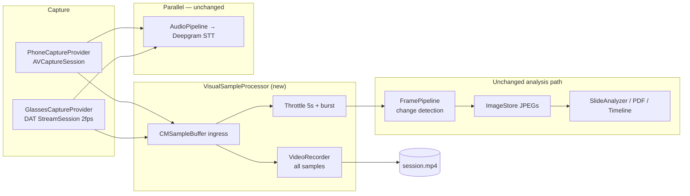

> **Technical review (2026-06-24):** Split into 4 PRs recommended. Simplify v1: merge hub+sampler into `VisualSampleProcessor`, keep `capturePhoto()` for live bookmarks, defer post-stop `FrameExtractor`. Resolve phone dual-mic strategy before Phase 1. See [Review notes](#technical-review-notes) below.

## feat: video-first capture with unified frame extraction — Standard

## Overview

Add **full-session MP4 recording** as the primary visual capture path for NoteV, while **preserving the existing frame analysis pipeline** (change detection, burst sampling, slide analysis, timeline images, PDF export, bookmarks).

The key design constraint: **do not run two parallel visual capture pipelines** (continuous video *and* a separate throttled JPEG camera path). Instead, use a **single ingress of video samples** (`CMSampleBuffer`) from phone camera or glasses DAT stream, then **fan out**:

1. **Video branch** — append every sample to `VideoRecorder` → `session.mp4`
2. **Analysis branch** — throttle the *same* samples into `TimestampedFrame` → existing `FramePipeline` → `ImageStore` JPEGs

Post-stop, bookmarks and high-precision seeks can **extract frames from the MP4** at exact timestamps via `AVAssetImageGenerator` (replacing `capturePhoto()` where possible).

## Problem Statement / Motivation

Today NoteV:

- Throttles camera output to ~1 JPEG every **5 seconds** (burst to **1s × 3** on slide change) in `PhoneCaptureProvider` / `GlassesCaptureProvider`
- Saves those JPEGs for LLM vision, timeline, PDF, and slide dedup
- Does **not** save watchable session video

A naive “add video” implementation would **double encode** (MP4 + JPEG stills from the same camera), wasting CPU, battery, and Bluetooth bandwidth on glasses. Users also asked for **full video playback**, not just sparse stills.

**Goal:** One visual source → MP4 for replay + extracted/downsampled frames for analysis.

## Proposed Solution

### Architecture: Unified Sample Buffer Hub

> **Review simplification:** Collapse `VisualSampleHub` + `FrameSampler` into a single **`VisualSampleProcessor`** (~10 lines of fan-out: record all, yield throttled frames). Defer standalone `FrameExtractor` to PR 3; keep `capturePhoto()` for live bookmarks in PR 1–2.



### Key design decisions (locked for v1)

| Decision | Choice | Rationale |
|----------|--------|-----------|
| Frame extraction timing | **Live fan-out from same buffers** (not offline-only) | Preserves live thumbnail, burst mode, and `frameCount` UX during recording |
| Analysis JPEG persistence | **Keep per-frame JPEG files** in session folder | Zero changes to `SlideAnalyzer`, `PDFGenerator`, `PromptBuilder`, `FrameDeduplicator` |
| MP4 audio (phone) | **Mux mic audio** via `AVCaptureAudioDataOutput` into MP4 | Watchable lecture replay; STT remains separate PCM tap (same mic, two consumers) |
| MP4 audio (glasses) | **Video-only MP4** in v1 | Glasses mic already routed via Bluetooth HFP → STT; muxing PCM into writer is phase 2 |
| Bookmarks | **Keep `capturePhoto()` for live bookmarks in PR 1–2**; add MP4 `FrameExtractor` in PR 3 for post-session seek / fallback |
| Post-session re-extract | **Optional validation pass** after stop | Re-extract bookmark timestamps from MP4 for sub-second accuracy if live fan-out drift detected |
| Failure mode | **Graceful degradation** | If MP4 fails, fall back to current JPEG-only path; warn user; still save transcript + frames |

### What stays the same

- `FramePipeline` change detection, burst mode, `maxFramesPerSession` (500)
- `AudioPipeline` / Deepgram STT (unchanged)
- `SessionData.frames[]` + `ImageStore` on-disk layout for JPEGs
- Note generation, transcript polishing, slide analysis contracts
- Frame sampling defaults in `NoteVConfig.Frame` (5s periodic, 0.15 change threshold, 3 burst frames @ 1s)

### What changes

| Area | Change |
|------|--------|
| `PhoneCaptureProvider` | Remove JPEG encode from throttle path; append all video buffers to hub; mux audio to MP4 |
| `GlassesCaptureProvider` | Append `VideoFrame.sampleBuffer` to hub; remove parallel JPEG encode |
| `SessionRecorder` | Own `VideoRecorder` lifecycle; set `metadata.videoFilename` on success |
| `CaptureProvider` | Hub/recorder injection via existing `videoRecorder` + new `VisualSampleHub` |
| Bookmarks | `SessionRecorder.triggerManualBookmark()` uses `FrameExtractor` at timestamp |
| `SessionResultView` | New **Video** tab with `AVPlayer` when `videoFilename` present |
| WIP cleanup | Finish wiring started in `VideoRecorder.swift`, `SessionMetadata.videoFilename`, `CaptureProvider.videoRecorder` |

## Technical Considerations

### Timestamp alignment

- **Problem:** Frames today use `Date().timeIntervalSince(sessionStart)`; video uses `CMSampleBuffer` presentation timestamps.
- **Fix:** Compute frame `timestamp` from `CMSampleBufferGetPresentationTimeStamp` relative to first video PTS (session time zero). Apply same clock to bookmark extraction seeks.
- **Acceptance tolerance:** ±500ms between frame timestamp and MP4 seek position.

### Burst mode on glasses (2 fps ceiling)

- DAT stream max ~2 fps — burst “1s × 3” cannot exceed source rate.
- **Behavior:** Burst mode on glasses lowers throttle to **0.5s** (every available frame) instead of 1s; document as platform limit in `NoteVConfig`.

### Stop ordering (critical)

```
1. Stop accepting new samples (provider flag)
2. Finish frameStream / audioStream continuations
3. Await FramePipeline + collectors drain
4. VideoRecorder.finishWriting() → session.mp4
5. Optional: FrameExtractor.extract(at: bookmark timestamps)
6. Assemble SessionData with videoFilename + frames
7. SessionStore.save()
```

Never mark session complete before `finishWriting` succeeds (or explicit fallback path chosen).

### Storage budget

| Artifact | 60 min lecture (estimate) |
|----------|---------------------------|
| `session.mp4` (720p H.264 phone) | ~500 MB–1.5 GB |
| JPEG frames (~720 @ 5s) | ~50–150 MB |
| `session.json` + transcript | < 5 MB |

- Add **low-disk preflight** before recording (warn if &lt; 2 GB free).
- Config flag `NoteVConfig.Video.enabled` default `true`; allow disable for storage-constrained devices.

### Partial WIP on branch

Uncommitted work already adds:

- `NoteV/Processing/VideoRecorder.swift` — AVAssetWriter wrapper (not wired)
- `SessionMetadata.videoFilename` — model field only
- `CaptureProvider.videoRecorder` — protocol property; `PhoneCaptureProvider` declares it
- `PhoneCaptureProvider` — `AVCaptureAudioDataOutput` added but not fully integrated
- `NoteVConfig.Storage.sessionVideoFilename` = `"session.mp4"`

**Plan first PR:** finish hub wiring + SessionRecorder lifecycle before UI polish.

### Security / privacy

- Video stored locally in app sandbox (`Documents/NoteVSessions/{uuid}/session.mp4`) — same as JPEGs today.
- No change to network upload; MP4 not sent to LLM in v1 (frames only, as today).

## Implementation Plan (4 PRs)

### PR 1 — Phone video-first pipeline (~450–550 LOC)

- [ ] Add `NoteV/Processing/VisualSampleProcessor.swift` — fan-out: all buffers → recorder; throttled subset → `TimestampedFrame`
- [ ] Wire burst callback: `FramePipeline.onSamplingIntervalChanged` → **processor** (remove provider `setSamplingInterval`)
- [ ] Wire `SessionRecorder.startRecording()`:
  - Create `{sessionId}/session.mp4`
  - Set `provider.videoRecorder` + processor before `startCapture()`
- [ ] Wire `SessionRecorder.stopRecording()` using merged stop sequence above
- [ ] Refactor `PhoneCaptureProvider`:
  - All video samples → processor (no pre-hub throttle)
  - Single mic path: `AVCaptureAudioDataOutput` → STT PCM + `VideoRecorder.appendAudio`
  - Remove `AVAudioEngine` mic tap during recording
- [ ] PTS-relative timestamps via shared session timebase (first video PTS = 0)
- [ ] Align preset to `NoteVConfig.Video.phoneSessionPreset`
- [ ] Add `SessionStore.videoURL(for:)` helper
- [ ] Tests: `VisualSampleProcessor`, `VideoRecorder`, PTS conversion, `SessionData` codable round-trip for `videoFilename`

### PR 2 — Glasses path (~150–220 LOC)

**Depends on PR 1**

- [ ] Add `videoRecorder` + processor to `GlassesCaptureProvider`
- [ ] Ingress `videoFrame.sampleBuffer` on background queue (hop off `@MainActor` publisher)
- [ ] Pass processor through `CaptureManager`
- [ ] Document 2 fps burst cap in `NoteVConfig`

### PR 3 — Bookmark MP4 extraction (~150–200 LOC)

**Depends on PR 1**

- [ ] Add `NoteV/Processing/FrameExtractor.swift`
- [ ] Post-stop or on-demand bookmark frame from MP4 at timestamp
- [ ] Keep `capturePhoto()` fallback

### PR 4 — Playback + hardening (~200–280 LOC)

**Depends on PR 1**

- [ ] Inline `VideoPlayer` in `SessionResultView` Video tab
- [ ] MP4 failure warning; simulator skip MP4
- [ ] Optional low-disk preflight

### Files touched (expected)

```
NoteV/Processing/VideoRecorder.swift          (existing WIP — finish)
NoteV/Processing/VisualSampleProcessor.swift (new — replaces hub+sampler)
NoteV/Processing/FrameExtractor.swift         (PR 3)
NoteV/Processing/SessionRecorder.swift        (wire lifecycle)
NoteV/Processing/FramePipeline.swift          (minimal — burst callback target)
NoteV/Capture/PhoneCaptureProvider.swift      (hub ingress, remove duplicate JPEG)
NoteV/Capture/GlassesCaptureProvider.swift    (hub ingress)
NoteV/Capture/CaptureManager.swift            (pass recorder/hub)
NoteV/Capture/CaptureProvider.swift           (hub protocol)
NoteV/Models/SessionData.swift                (videoFilename — done)
NoteV/Config/NoteVConfig.swift                (Video enum — partial)
NoteV/Storage/SessionStore.swift              (videoURL helper)
NoteV/Views/SessionResultView.swift           (Video tab)
NoteV/Views/Components/SessionVideoPlayerView.swift (new)
NoteV.xcodeproj/project.pbxproj               (new files)
project.yml                                   (if using xcodegen)
README.md                                     (video feature note — optional)
```

## Acceptance Criteria

- [ ] **Single ingress:** Phone and glasses feed one visual sample stream; no separate parallel JPEG-only camera pipeline during recording
- [ ] **MP4 artifact:** Successful sessions persist `{sessionId}/session.mp4`; `SessionMetadata.videoFilename == "session.mp4"`
- [ ] **Analysis parity:** Frame count, change detection, burst behavior, and `maxFramesPerSession` match current baseline within glasses 2 fps limits
- [ ] **Live UX:** `frameCount` and `FrameThumbnailView` update during recording (via fan-out, not post-session wait)
- [ ] **Downstream unchanged:** `SlideAnalyzer`, `TranscriptPolisher`, `PDFGenerator`, and timeline views work without modification to their inputs
- [ ] **Bookmarks:** Manual bookmark produces `bookmark_N.jpg` at correct timestamp (MP4 extraction or photo fallback)
- [ ] **Stop integrity:** Session not marked complete with corrupt/truncated MP4; `finishWriting` completes or fallback path documented
- [ ] **Timestamp accuracy:** Frame timestamps derived from video PTS; bookmark seek aligns within ±500ms
- [ ] **Failure degradation:** Video failure shows user warning; transcript + frames still saved when possible
- [ ] **Playback:** Session result Video tab plays local MP4 for phone and glasses sessions
- [ ] **Bundle ID unchanged:** `com.seatrials.notev` — no Meta DAT config regression

## Success Metrics

- Zero duplicate full-rate JPEG encodes during recording (verify via Instruments: one H.264 encode path + sparse JPEG writes)
- MP4 playable for ≥95% of successful phone sessions in manual testing
- Frame analysis output (slide count, timeline images) within ±10% of pre-change baseline on same lecture fixture
- Session stop adds &lt; 3s latency vs today (finishWriting on device)

## Dependencies & Risks

| Risk | Mitigation |
|------|------------|
| Post-session-only extraction breaks live UX | **Rejected** — use live fan-out per design decision |
| Glasses H.264 writer incompatibility | Use `VideoFrame.sampleBuffer` format as writer input; test on physical Vanguard/Wayfarer |
| Timestamp drift | PTS-relative timestamps; post-stop bookmark re-extract |
| Disk exhaustion | Preflight + config toggle to disable video |
| Stop-order race corrupts MP4 | Enforce ordered teardown sequence above |
| Partial WIP ships half-wired | Phase 1 completes SessionRecorder before UI |
| Meta glasses registration (separate issue) | Out of scope; video plan does not change DAT config |

## Testing Plan

### Manual (device required for glasses)

- [ ] Phone: 2 min recording → MP4 plays back with audio; timeline has frames; PDF includes images
- [ ] Phone: slide change triggers burst (verify ≥3 frames in quick succession in logs)
- [ ] Phone: manual bookmark → `bookmark_1.jpg` matches video seek at timestamp
- [ ] Glasses: 2 min recording → MP4 exists; frames extracted at ~2 fps max
- [ ] Stop during active recording → MP4 not corrupt; session saves
- [ ] Force video failure (disk full simulation) → user warning + frames/transcript saved
- [ ] Simulator: recording completes without crash; video skipped gracefully

### Automated (where feasible)

- [ ] Unit test `FrameSampler` throttle + burst interval transitions
- [ ] Unit test PTS → session timestamp conversion
- [ ] `FrameExtractor` test with bundled short test MP4 fixture in `NoteVTests/`

## References & Research

### Codebase (current)

- Throttle + JPEG encode: `NoteV/Capture/PhoneCaptureProvider.swift:267-299`
- Glasses stream + JPEG: `NoteV/Capture/GlassesCaptureProvider.swift:119-144`
- Frame change detection: `NoteV/Processing/FramePipeline.swift`
- Session orchestration: `NoteV/Processing/SessionRecorder.swift`
- WIP recorder: `NoteV/Processing/VideoRecorder.swift`
- Config: `NoteV/Config/NoteVConfig.swift` (`Frame`, `Storage`, `Video`)
- DAT `VideoFrame.sampleBuffer`: Meta `MWDATCamera` SDK

### External

- [Apple AVAssetWriter — recording video](https://developer.apple.com/documentation/avfoundation/avassetwriter)
- [Apple AVAssetImageGenerator — frame extraction](https://developer.apple.com/documentation/avfoundation/avassetimagegenerator)
- [Meta DAT iOS integration](https://wearables.developer.meta.com/docs/develop/dat/build-integration-ios/)

### Flow analysis

- User-flow-analysis-agent identified live-vs-post extraction as blocking decision → **resolved: live fan-out**
- See agent transcript: [video-first flow analysis](2315535f-ee65-49b1-84f4-62420bce53dd)

## Out of Scope (v1)

- Uploading or streaming MP4 to cloud
- Sending video to LLM (frames only, as today)
- Re-encoding or editing MP4 in-app
- Glasses audio mux into MP4 (phase 2)
- Extracting frames from old sessions recorded before this feature (no MP4 exists)

## Technical Review Notes

**Verdict:** Proceed after amendments above (simplicity + VGV review incorporated).

| Review | Key finding |
|--------|-------------|
| [Simplicity](9e5dccc8-12ee-41eb-9dca-65f3fdd97782) | Merge hub+sampler; defer extractor to PR 3; keep live bookmark photos |
| [VGV](caaff13a-d785-4350-ac29-d21b9513645e) | Fix stop-order + STT; single mic path; burst → processor; add VideoRecorder tests |
| [Split](e5d63dfd-f10f-4388-859c-c99bd700493b) | 4 PRs (~900–1200 LOC total) — do not ship as one PR |
