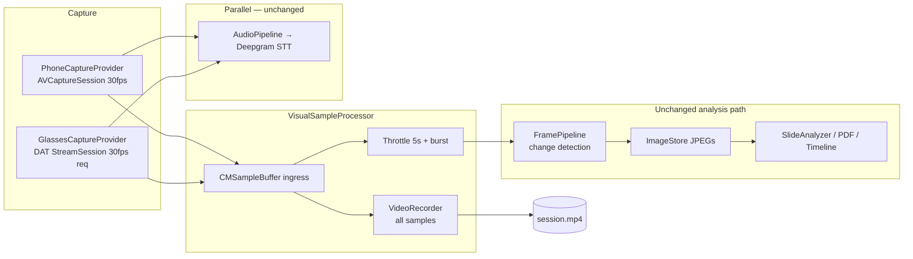

> **Technical review (2026-06-24, pass 2):** PR1+PR2 **implemented** on branch. Remaining work (~350–480 LOC): playback UI, optional `FrameExtractor`, hardening. Ship remainder as **one PR** (or optionally 2: extractor → UI). See [Implementation status](#implementation-status) and [Review notes](#technical-review-notes).

## feat: video-first capture with unified frame extraction — Standard

## Overview

Add **full-session MP4 recording** as the primary visual capture path for NoteV, while **preserving the existing frame analysis pipeline** (change detection, burst sampling, slide analysis, timeline images, PDF export, bookmarks).

The key design constraint: **do not run two parallel visual capture pipelines** (continuous video *and* a separate throttled JPEG camera path). Instead, use a **single ingress of video samples** (`CMSampleBuffer`) from phone camera or glasses DAT stream, then **fan out**:

1. **Video branch** — append every sample to `VideoRecorder` → `session.mp4`
2. **Analysis branch** — throttle the *same* samples into `TimestampedFrame` → existing `FramePipeline` → `ImageStore` JPEGs

Post-stop, bookmarks can optionally **extract frames from the MP4** at exact timestamps via `AVAssetImageGenerator` (phase 2; v1 uses `capturePhoto()`).

## Problem Statement / Motivation

Today NoteV:

- Throttles camera output to ~1 JPEG every **5 seconds** (burst to **1s × 3** on slide change) in `PhoneCaptureProvider` / `GlassesCaptureProvider`
- Saves those JPEGs for LLM vision, timeline, PDF, and slide dedup
- Does **not** save watchable session video

A naive “add video” implementation would **double encode** (MP4 + JPEG stills from the same camera), wasting CPU, battery, and Bluetooth bandwidth on glasses. Users also asked for **full video playback**, not just sparse stills.

**Goal:** One visual source → MP4 for replay + extracted/downsampled frames for analysis.

## Proposed Solution

### Architecture: Unified Sample Buffer Processor

> **Review simplification (implemented):** Single **`VisualSampleProcessor`** fans out: record all samples, yield throttled frames. Defer standalone `FrameExtractor` to remaining PR; keep `capturePhoto()` for live bookmarks in v1.



### Key design decisions (locked for v1)

| Decision | Choice | Rationale |
|----------|--------|-----------|
| Frame extraction timing | **Live fan-out from same buffers** (not offline-only) | Preserves live thumbnail, burst mode, and `frameCount` UX during recording |
| Analysis JPEG persistence | **Keep per-frame JPEG files** in session folder | Zero changes to `SlideAnalyzer`, `PDFGenerator`, `PromptBuilder`, `FrameDeduplicator` |
| MP4 audio (phone) | **Mux mic audio** via `AVCaptureAudioDataOutput` into MP4 | Watchable lecture replay; STT remains separate PCM tap (same mic, two consumers) |
| MP4 audio (glasses) | **Video-only MP4** in v1 | Glasses mic already routed via Bluetooth HFP → STT; muxing PCM into writer is phase 2 |
| Bookmarks | **`capturePhoto()` in v1**; optional MP4 `FrameExtractor` fallback in remaining PR | Live bookmark UX without waiting for post-stop extraction |
| Post-session re-extract | **Deferred (YAGNI)** | Add only if device testing proves ±500ms drift between live frames and MP4 seek |
| Failure mode | **Graceful degradation** | If MP4 fails, fall back to current JPEG-only path; warn user; still save transcript + frames |
| Glasses frame rate | **Request 30 fps** via `StreamSessionConfig.frameRate` | Phone reliably delivers 30 fps; glasses DAT adaptively reduces under bandwidth — validate effective rate on hardware |

### What stays the same

- `FramePipeline` change detection, burst mode, `maxFramesPerSession` (500)
- `AudioPipeline` / Deepgram STT (unchanged)
- `SessionData.frames[]` + `ImageStore` on-disk layout for JPEGs
- Note generation, transcript polishing, slide analysis contracts
- Frame sampling defaults in `NoteVConfig.Frame` (5s periodic, 0.15 change threshold, 3 burst frames @ 1s)

### What changes

| Area | Change |
|------|--------|
| `PhoneCaptureProvider` | All video samples → processor; mux audio to MP4; single mic path |
| `GlassesCaptureProvider` | Ingress `VideoFrame.sampleBuffer` → processor; remove legacy JPEG path after device validation |
| `SessionRecorder` | Own `VideoRecorder` + processor lifecycle; inject on provider; set `metadata.videoFilename` on success |
| `CaptureProvider` | `videoRecorder` + `visualSampleProcessor` injection (via `SessionRecorder`, not `CaptureManager`) |
| Bookmarks | **`capturePhoto()`** for live bookmarks; optional `FrameExtractor` fallback in remaining PR |
| `SessionResultView` | New **Video** tab with inline `VideoPlayer` when `videoFilename` present |

## Technical Considerations

### Timestamp alignment

- **Problem:** Frames use PTS via processor; glasses audio still uses `Date().timeIntervalSince(sessionStart)` in the `AVAudioEngine` tap.
- **Fix (video frames):** Compute frame `timestamp` from `CMSampleBufferGetPresentationTimeStamp` relative to first video PTS (session time zero). ✅ Implemented in `VisualSampleProcessor`.
- **Fix (glasses audio — PR2 polish):** Align glasses audio timestamps to the same PTS timebase or document drift and accept for v1.
- **Acceptance tolerance:** ±500ms between frame timestamp and MP4 seek position (bookmarks via `capturePhoto()` may not meet this until PR3 `FrameExtractor`).

### Burst mode on glasses

- DAT SDK allows requesting 2/7/15/24/30 fps; **effective rate is bandwidth-limited** (often well below request on Ray-Ban Gen 2 / Vanguard).
- **Config:** `NoteVConfig.Video.glassesStreamFrameRate = 30` (request max; device may deliver less).
- **Behavior:** Burst mode lowers processor throttle to 1.0s (same as phone). If effective glasses rate is ~2 fps, burst cannot exceed source rate — validate on hardware and add `NoteVConfig.Frame.glassesBurstSamplingInterval = 0.5` if needed.

### Stop ordering (critical)

```
1. Stop accepting new samples (provider flag)
2. stopCapture() → finish frameStream / audioStream continuations
3. Await FramePipeline + AudioPipeline tasks (drain raw input)
4. endAudio + waitForFinalResult + finish output streams (STT finalization)
5. framePipeline.stop() → await transcript + frame collectors
6. **Drain processor + VideoRecorder queues** (barrier before finish)   ← REQUIRED
7. VideoRecorder.finishRecording() → session.mp4
8. Assemble SessionData with videoFilename + frames
9. SessionStore.save()
```

Never mark session complete before `finishWriting` succeeds (or explicit fallback path chosen).

**Known gap:** Step 6 not yet implemented — `VisualSampleProcessor` and `VideoRecorder` use separate serial queues; `finishRecording()` can race with in-flight `appendVideo` blocks.

### Storage budget

| Artifact | 60 min lecture (estimate) |
|----------|---------------------------|
| `session.mp4` (720p H.264 phone @ 30fps) | ~500 MB–1.5 GB |
| JPEG frames (~720 @ 5s) | ~50–150 MB |
| `session.json` + transcript | < 5 MB |

- Optional **low-disk preflight** before recording (warn if &lt; 2 GB free) — remaining PR.
- Config flag `NoteVConfig.Video.enabled` default `true`; allow disable for storage-constrained devices.

### Security / privacy

- Video stored locally in app sandbox (`Documents/NoteVSessions/{uuid}/session.mp4`) — same as JPEGs today.
- No change to network upload; MP4 not sent to LLM in v1 (frames only, as today).

## Implementation Status

### Done (PR1 + PR2 — landed on branch)

- [x] `VisualSampleProcessor` — fan-out: all buffers → recorder; throttled subset → `TimestampedFrame`
- [x] `VideoRecorder` — AVAssetWriter wrapper, wired via `SessionRecorder`
- [x] Burst callback: `FramePipeline.onSamplingIntervalChanged` → processor
- [x] `SessionRecorder.startRecording()` — create MP4, inject processor + recorder on provider
- [x] `SessionRecorder.stopRecording()` — STT-safe teardown sequence (steps 1–5, 7–9)
- [x] `PhoneCaptureProvider` — all video → processor; 30fps; `AVCaptureAudioDataOutput` → STT + MP4; removed `AVAudioEngine` mic tap
- [x] `GlassesCaptureProvider` — `videoIngressProcessor`; DAT 30fps request; processor fan-out
- [x] PTS-relative timestamps via processor timebase
- [x] `SessionMetadata.videoFilename` + codable round-trip
- [x] `SessionStore.videoURL(for:)`
- [x] Partial tests: PTS conversion, recorder lifecycle, codable, `videoURL` (`VideoPipelineTests.swift`)

### Remaining (single PR ~350–480 LOC)

- [ ] **Queue drain before `finishRecording`** — `processor.flushAndWait()` + `videoRecorder.waitForPendingAppends()`
- [ ] **Processor throttle/burst unit tests** — periodic gate at 5s, burst interval 5s → 1s → 5s
- [ ] Remove glasses legacy JPEG fallback path (~40 LOC) once processor injection confirmed
- [ ] Remove redundant `glassesProvider.setSamplingInterval` from burst callback (processor only)
- [ ] Glasses audio PTS alignment (or document v1 drift acceptance)
- [ ] Add `NoteV/Processing/FrameExtractor.swift` (optional — skip if `capturePhoto()` sufficient)
- [ ] Inline `VideoPlayer` in `SessionResultView` Video tab (no separate view file)
- [ ] Surface `videoRecordingFailed` to user (banner in result view)
- [ ] Optional low-disk preflight
- [ ] Document glasses effective fps / burst cap in `NoteVConfig` after device validation

## Implementation Plan

### ~~PR 1 — Phone video-first pipeline~~ ✅ Done

### ~~PR 2 — Glasses path~~ ✅ Done (same commit as PR1)

### PR 3 — Remaining: playback, extraction, hardening (~350–480 LOC)

**Depends on:** PR1+PR2 (complete)

**Optional split:** If reviewers prefer layer separation, split into PR3a (`FrameExtractor` + tests) and PR3b (playback UI + hardening). Default: ship as one PR.

- [ ] Queue drain fix (blocker for merge confidence)
- [ ] Processor throttle/burst tests
- [ ] Glasses cleanup (legacy path, burst wiring)
- [ ] `FrameExtractor` + bookmark MP4 fallback (optional)
- [ ] Video tab in `SessionResultView`
- [ ] User-visible video failure warning
- [ ] Optional low-disk preflight

### Files touched

```
NoteV/Processing/VideoRecorder.swift          (done — add queue drain)
NoteV/Processing/VisualSampleProcessor.swift  (done — add flushAndWait)
NoteV/Processing/FrameExtractor.swift         (remaining — optional)
NoteV/Processing/SessionRecorder.swift        (done — drain fix remaining)
NoteV/Processing/FramePipeline.swift          (done — burst callback)
NoteV/Capture/PhoneCaptureProvider.swift      (done)
NoteV/Capture/GlassesCaptureProvider.swift    (done — legacy cleanup remaining)
NoteV/Capture/CaptureProvider.swift             (done)
NoteV/Models/SessionData.swift                (done)
NoteV/Config/NoteVConfig.swift                (done — glasses burst doc remaining)
NoteV/Storage/SessionStore.swift              (done)
NoteV/Views/SessionResultView.swift           (remaining — Video tab)
NoteVTests/VideoPipelineTests.swift           (partial — throttle tests remaining)
NoteV.xcodeproj/project.pbxproj               (done)
```

## Acceptance Criteria

- [x] **Single ingress:** Phone and glasses feed one visual sample stream; no separate parallel JPEG-only camera pipeline during recording
- [x] **MP4 artifact:** Successful sessions persist `{sessionId}/session.mp4`; `SessionMetadata.videoFilename == "session.mp4"`
- [ ] **Analysis parity:** Frame count, change detection, burst behavior match baseline (validate on device; glasses effective fps may be lower than 30)
- [x] **Live UX:** `frameCount` and `FrameThumbnailView` update during recording (via fan-out)
- [x] **Downstream unchanged:** `SlideAnalyzer`, `TranscriptPolisher`, `PDFGenerator`, and timeline views work without modification
- [ ] **Bookmarks:** Manual bookmark produces `bookmark_N.jpg` via `capturePhoto()` (MP4 extraction optional)
- [ ] **Stop integrity:** No truncated MP4 — recorder queue drained before `finishWriting`
- [x] **Timestamp accuracy (video frames):** Frame timestamps derived from video PTS
- [ ] **Failure degradation:** Video failure shows **user-visible** warning; transcript + frames still saved
- [ ] **Playback:** Session result Video tab plays local MP4
- [x] **Bundle ID unchanged:** `com.seatrials.notev`

## Success Metrics

- Zero duplicate full-rate JPEG encodes during recording (verify via Instruments: one H.264 encode path + sparse JPEG writes)
- MP4 playable for ≥95% of successful phone sessions in manual testing
- Frame analysis output (slide count, timeline images) within ±10% of pre-change baseline on same lecture fixture
- Session stop adds &lt; 3s latency vs today (finishWriting on device)

## Dependencies & Risks

| Risk | Mitigation |
|------|------------|
| Post-session-only extraction breaks live UX | **Rejected** — use live fan-out per design decision |
| Glasses H.264 writer incompatibility | Use `VideoFrame.sampleBuffer` format as writer input; test on physical Vanguard/Wayfarer |
| Timestamp drift (glasses audio vs video PTS) | Align glasses audio clock or document v1 acceptance |
| Disk exhaustion | Preflight + config toggle to disable video |
| Stop-order race corrupts MP4 | **Add queue drain (step 6)** before `finishWriting` |
| Glasses effective fps &lt; requested 30 | Document in config; burst cannot exceed source rate |
| Meta glasses registration (separate issue) | Out of scope; video plan does not change DAT config |

## Testing Plan

### Manual (device required for glasses)

- [ ] Phone: 2 min recording → MP4 plays back with audio; timeline has frames; PDF includes images
- [ ] Phone: slide change triggers burst (verify ≥3 frames in quick succession in logs)
- [ ] Phone: manual bookmark → `bookmark_1.jpg` exists
- [ ] Glasses: 2 min recording → MP4 exists; frames throttled for analysis
- [ ] Stop during active recording → MP4 not corrupt; session saves
- [ ] Force video failure (disk full simulation) → user warning + frames/transcript saved
- [ ] Simulator: recording completes without crash; video skipped gracefully

### Automated

- [x] Unit test PTS → session timestamp conversion
- [x] `VideoRecorder` lifecycle + codable round-trip for `videoFilename`
- [ ] Unit test `VisualSampleProcessor` throttle + burst interval transitions
- [ ] Recorder queue drain before finish (integration or spy)
- [ ] `FrameExtractor` test with bundled test MP4 fixture (if extractor shipped)

## References & Research

### Codebase (current)

- Visual fan-out: `NoteV/Processing/VisualSampleProcessor.swift`
- MP4 writer: `NoteV/Processing/VideoRecorder.swift`
- Session orchestration: `NoteV/Processing/SessionRecorder.swift`
- Phone capture: `NoteV/Capture/PhoneCaptureProvider.swift`
- Glasses capture: `NoteV/Capture/GlassesCaptureProvider.swift`
- Frame change detection: `NoteV/Processing/FramePipeline.swift`
- Config: `NoteV/Config/NoteVConfig.swift` (`Frame`, `Storage`, `Video`)
- Tests: `NoteVTests/VideoPipelineTests.swift`
- DAT `VideoFrame.sampleBuffer`: Meta `MWDATCamera` SDK

### External

- [Apple AVAssetWriter — recording video](https://developer.apple.com/documentation/avfoundation/avassetwriter)
- [Apple AVAssetImageGenerator — frame extraction](https://developer.apple.com/documentation/avfoundation/avassetimagegenerator)
- [Meta DAT iOS integration](https://wearables.developer.meta.com/docs/develop/dat/build-integration-ios/)

## Out of Scope (v1)

- Uploading or streaming MP4 to cloud
- Sending video to LLM (frames only, as today)
- Re-encoding or editing MP4 in-app
- Glasses audio mux into MP4 (phase 2)
- Extracting frames from old sessions recorded before this feature (no MP4 exists)
- Post-stop bookmark re-extract validation pass (add only if drift observed)

## Technical Review Notes

**Verdict (pass 2):** PR1+PR2 architecture sound and implemented. **Block remaining PR merge** on recorder queue drain + processor throttle tests. Refresh plan (this pass) before `/build`.

| Review | Key finding |
|--------|-------------|
| [Simplicity](d3715e84-7b27-40d1-845b-5d6d890404e2) | Core design lean; remove glasses legacy path; defer `FrameExtractor`; inline `VideoPlayer`; plan was stale on WIP/2fps |
| [VGV](9b6ba6df-a787-4838-be03-dbe2aa3ea000) | Cross-queue drain race before `finishRecording`; glasses audio PTS drift; add throttle tests; surface video failure to user |
| [Split](c4f2aedb-1e72-41f2-909d-655747cd0f48) | Original 4-PR split obsolete — PR1+2 done; **ship remainder as 1 PR** (~350–480 LOC) |
