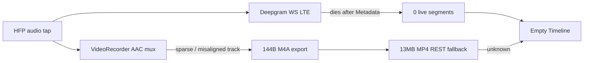

## fix: Glasses LTE Deepgram Transcript + MP4 Audio Recovery — Standard

## Overview

A **20s Oakley Meta glasses session on LTE** captured video and MP4 audio successfully (HFP route active, 7 frames, `Muxed 186 audio samples`, 13MB MP4 saved) but produced **zero live transcript segments** and fragile post-stop recovery.

This plan fixes the three aligned failure points:

1. **Deepgram WebSocket** connects, receives Metadata, then dies on LTE — no mid-session recovery, no user warning
2. **Post-stop `SessionTranscriptExtractor`** — M4A export returns **144 bytes** (corrupt); falls back to **13MB MP4 upload** on cellular
3. **Live UX** — user sees "Connecting…" / "Listening…" with no indication STT failed while capture continues

**What already works (do not regress):**

- HFP-first glasses mic routing (`GlassesHFPRoute`, Oakley Meta 02TT in logs)
- DAT video stream (7 frames, burst sampling)
- MP4 file written with AAC track (186 samples appended)

## Problem Statement / Motivation

### Observed session log (`EDFA5BD9`, ~20s, LTE)

| Stage | Log evidence | Result |
|-------|--------------|--------|
| HFP mic | `Preferred input set to HFP: Oakley Meta 02TT`, `HFP route active` | ✅ |
| DAT video | `StreamSession state: streaming`, 7 frames | ✅ |
| Live Deepgram | `Metadata received` → `Socket is not connected` on `pdp_ip0[lte]` | ❌ 0 segments |
| MP4 mux | `Audio input not ready — buffering (21–23 queued)`, `Muxed 186 audio samples` | ⚠️ sparse start |
| Post-stop STT | `Exported audio too small (144 bytes)` → `Uploading 13026398 bytes` | ⚠️ slow fallback |

User expectation: **glasses audio → phone Deepgram → live transcript + recoverable notes**. Current behavior: silent STT failure, ambiguous UI, unreliable post-stop path on LTE.

### Root cause hypothesis

Three **independent** weak points aligned in one session:



Fixing only the WebSocket without validating MP4 audio integrity may leave post-stop recovery broken.

## Proposed Solution

Ship as **one PR** (~300–450 LOC) with three workstreams in dependency order:

### Workstream 1 — Detect and surface live STT failure (P0)

**Goal:** User never sits through a full class thinking transcription is working when it isn't.

| Task | File(s) | Change |
|------|---------|--------|
| Track STT connection state | `AppState.swift` | Add `liveTranscriptStatus: .connecting / .streaming / .unavailable` |
| Detect WS death after connect | `DeepgramService.swift` | Publish disconnect reason; distinguish Metadata-then-death vs timeout |
| Mid-session reconnect OR degraded mode | `AudioPipeline.swift` | On `handleConnectionLost` after `isConnected`, attempt reconnect (max 2) with backoff; if exhausted, set `.unavailable` and stop silent `sendAudio` drops |
| Live UI banner | `LiveSessionView.swift`, `TranscriptScrollView.swift` | Show warning within 5s of STT failure: *"Live transcription unavailable — recording continues. Transcript will be recovered after class."* |
| Hint copy | `SessionRecorder.swift` | Keep glasses hint; clear only when segments arrive **or** status becomes `.unavailable` |

**Design decision (default):** Reconnect once mid-session on LTE; if still dead, enter **record-only degraded mode** and rely on post-stop REST (don't buffer unbounded audio for a dead socket).

### Workstream 2 — MP4 audio health + reliable post-stop payload (P0)

**Goal:** Post-stop transcription uses a **small, valid audio file**, not a 144-byte corrupt M4A or 13MB MP4 on LTE.

| Task | File(s) | Change |
|------|---------|--------|
| Fix session-start audio gap | `VideoRecorder.swift` | Start writer session on **first audio** if video hasn't arrived yet (glasses path: HFP starts before DAT video). Today audio buffers until first video frame (`sessionStarted == false`). |
| Health metrics at stop | `SessionRecorder.swift` | Log + store: `audioSamplesAppended`, track duration via `AVAsset`, session duration |
| Validate before export | `SessionTranscriptExtractor.swift` | After export, check **file size ≥ 2048** AND **track duration ≥ 50% of video duration** (configurable) |
| PCM fallback extraction | `SessionTranscriptExtractor.swift` (new helper) | If M4A export fails, use `AVAssetReader` to read AAC track → PCM/WAV for Deepgram REST (avoid full MP4 upload) |
| REST upload tuning | `SessionTranscriptExtractor.swift` | Set `Content-Type: audio/wav` or `audio/m4a`; add `?detect_encoding=true` if sending MP4 fallback; log HTTP status + latency |
| Warn on sparse mux | `SessionRecorder.swift` | If `audioSamplesAppended < expectedMinimum(sessionDuration)`, set `videoRecordingWarning` about impaired transcript recovery |

**Why 144-byte M4A happens:** `AVAssetExportPresetAppleM4A` completes but produces an empty/near-empty file when the AAC track is sparse, mis-timestamped, or the writer session started late. PCM extraction bypasses re-mux.

### Workstream 3 — Post-processing UX + LTE WebSocket hardening (P1)

| Task | File(s) | Change |
|------|---------|--------|
| Dedicated transcript stage | `PostProcessingOrchestrator.swift`, `PostProcessingStage` | Add `.recoveringTranscript` between `finalizing` and `extractingFrames` |
| URLSession for WebSocket | `DeepgramService.swift` | Use `URLSessionConfiguration.default` with `waitsForConnectivity = true`, `timeoutIntervalForRequest = 60`; consider `multipathServiceType = .handover` for LTE↔WiFi |
| Instrument REST outcome | `PostProcessingOrchestrator.swift` | Log segment count, upload bytes, elapsed ms; surface failure in `processingWarnings` |
| Optional: parallel live buffer file | `SessionRecorder.swift` | Write 16 kHz PCM to temp file during session as **backup for post-stop** (only if Workstream 2 insufficient on device test) |

## Technical Considerations

### Deepgram on LTE

- Logs show Metadata arrives then TCP RST (`flags=[R]`) on cellular — classic flaky WebSocket on `pdp_ip0`
- Current retry (`connectDeepgramWithRetry` ×3) only runs **at session start**; connect succeeds then dies ~0s later
- `sendAudio` returns silently when `!isConnected` — audio chunks lost with no UI signal
- Reference: [Deepgram streaming docs](https://developers.deepgram.com/docs/live-streaming-audio)

### MP4 audio on glasses path

- HFP delivers **16 kHz** hardware format (log: `16000Hz, 1ch`); resampled to 48 kHz for AAC mux
- `VideoRecorder` pre-configures AAC at 48 kHz; first audio may arrive **before** first video frame after HFP-first reorder — currently dropped into `pendingAudioBuffers` until video starts session
- 186 samples / 20s may be low depending on tap buffer size — **validate on device** with `audioSamplesAppended` vs wall-clock duration

### Post-stop extraction today

- `NoteVConfig.TranscriptExtraction.enabled = true`
- Runs inside `.extractingFrames` stage (misleading label)
- Fallback to full MP4 is correct as last resort but expensive on LTE (13MB)

### Architecture (unchanged)

```
Glasses HFP → AVAudioEngine → 16kHz → Deepgram WS (live)
                           → 48kHz → VisualSampleProcessor → VideoRecorder → session.mp4
Post-stop: session.mp4 → SessionTranscriptExtractor → Deepgram REST
```

## Acceptance Criteria

### Live session (glasses + LTE)

- [ ] Within **10s** of start, UI shows **segments**, **connecting**, or **unavailable** — not indefinite ambiguous hint
- [ ] If WS dies after Metadata, user sees non-blocking warning within **5s**
- [ ] Warning states recording/video continue and post-stop recovery will run
- [ ] Smart bookmarks disabled with notice when live STT unavailable (optional P1)

### MP4 audio integrity

- [ ] 20s glasses session: MP4 AAC track duration ≥ **15s** (or proportional threshold)
- [ ] Audio captured before first video frame is **included** in MP4 (no silent first 3+ seconds when user spoke)
- [ ] `stopRecording` logs audio health metrics; sparse mux triggers `videoRecordingWarning`

### Post-stop recovery

- [ ] 0 live segments + valid speech → **≥1 transcript segment** recovered without 13MB upload when session ≤ 5 min
- [ ] 144-byte exports rejected **before** REST call; PCM/WAV path attempted next
- [ ] Post-processing shows **"Recovering transcript…"** as distinct stage
- [ ] Success removes *"Live transcription unavailable"* warning; failure shows *"Transcript could not be recovered — notes based on slides only"*

### End-to-end

- [ ] Glasses + LTE 20s spoken session → Timeline shows transcript (live or recovered)
- [ ] AI Notes use transcript + frames when speech present
- [ ] Wi‑Fi glasses sessions: no regression in live STT latency
- [ ] All existing unit tests pass; add tests for `SessionTranscriptExtractor` PCM fallback and audio validation

## Success Metrics

| Metric | Target |
|--------|--------|
| Live STT failure visibility | 100% of WS deaths surfaced in UI within 5s |
| Post-stop recovery (0 live segments, healthy audio) | ≥95% sessions get transcript on LTE |
| Post-stop upload size (20s session) | < 1 MB audio-only path |
| 144-byte M4A uploads | 0 |

## Dependencies & Risks

| Risk | Mitigation |
|------|------------|
| LTE WebSocket fundamentally unreliable | Degraded mode + post-stop REST + optional PCM sidecar |
| MP4 AAC still corrupt after VideoRecorder fix | PCM sidecar backup; AVAssetReader extraction |
| Deepgram REST timeout on 13MB MP4 | Prefer small audio payload; 300s timeout already set |
| Over-reconnecting wastes battery/data | Cap mid-session reconnects at 2 |
| Apple Speech fallback rejected by user | Deepgram-only; no on-device fallback |

## Implementation Tasks

### Phase 1 — Instrumentation (half day)

- [ ] Add audio health logging in `SessionRecorder.stopRecording()` (`VideoRecorder.audioSampleCount`, asset duration)
- [ ] Add Deepgram disconnect reason logging in `DeepgramService.handleConnectionLost`
- [ ] Reproduce on device: confirm REST fallback outcome for session `EDFA5BD9`-class logs

### Phase 2 — VideoRecorder audio-before-video (1 day)

- [ ] `VideoRecorder.swift`: allow `startSessionIfNeeded` on first **audio** sample when video input not yet configured (audio-only session start)
- [ ] Flush `pendingAudioBuffers` after session start; add unit test in `VideoPipelineTests.swift`
- [ ] Device test: verify no "Audio input not ready" storm at session start

### Phase 3 — Live STT resilience + UI (1 day)

- [ ] `DeepgramService.swift`: URLSession config for cellular; expose connection state stream
- [ ] `AudioPipeline.swift`: mid-session reconnect; stop silent drops; wire `AppState.liveTranscriptStatus`
- [ ] `LiveSessionView.swift` + `TranscriptScrollView.swift`: failure banner

### Phase 4 — Post-stop extraction (1 day)

- [ ] `SessionTranscriptExtractor.swift`: duration validation; `AVAssetReader` PCM/WAV fallback
- [ ] `PostProcessingOrchestrator.swift`: new `.recoveringTranscript` stage
- [ ] `SessionTranscriptExtractorTests.swift`: corrupt M4A, PCM fallback, size threshold cases

### Phase 5 — Device validation matrix

| Test | Pass |
|------|------|
| Glasses + LTE, 30s speech | Live segments OR warning + recovered transcript |
| Glasses + Wi‑Fi, 30s speech | Live segments within 10s |
| End at 5s (before WS ready) | Post-stop recovery if MP4 audio healthy |
| Airplane mode mid-session | Warning + graceful stop |

## References & Research

### Codebase

- `NoteV/Capture/GlassesCaptureProvider.swift` — HFP-first capture (working in logs)
- `NoteV/Services/DeepgramService.swift` — WebSocket STT, Metadata timeout
- `NoteV/Processing/AudioPipeline.swift` — connect retry, feed coordinator
- `NoteV/Processing/VideoRecorder.swift` — AAC mux, pending audio buffers
- `NoteV/Processing/SessionTranscriptExtractor.swift` — REST fallback
- `NoteV/Processing/PostProcessingOrchestrator.swift` — post-stop pipeline
- `NoteV/Config/NoteVConfig.swift` — `TranscriptExtraction`, `deepgramConnectBufferMaxChunks`

### Prior plans

- `docs/plan/2026-06-24-docs-meta-dat-glasses-video-audio-streaming-research-plan.md` — glasses audio architecture validated
- `docs/plan/2026-06-24-feat-post-processing-pipeline-plan.md` — post-stop extraction design
- `docs/brainstorm/2026-06-24-post-processing-pipeline-brainstorm-doc.md` — ±500ms timestamp tolerance

### External

- [Deepgram live streaming](https://developers.deepgram.com/docs/live-streaming-audio)
- [Deepgram pre-recorded API](https://developers.deepgram.com/docs/pre-recorded-audio)
- [AVAssetReader audio extraction](https://developer.apple.com/documentation/avfoundation/avassetreader)

## Out of Scope

- Apple Speech cellular fallback (user wants Deepgram only)
- On-glasses STT
- SDK 0.4 → 0.7 DAT migration
- Re-encoding MP4 in-app for unrelated quality improvements

## Open Questions

1. Did the **13MB REST fallback succeed** for this session? (Check post-processing logs or re-run on saved MP4)
2. Is **186 audio samples / 20s** expected for HFP tap rate, or a mux bug? (Phase 1 instrumentation answers this)
3. Should we persist a **16 kHz PCM sidecar** during recording as ultimate post-stop backup? (Defer unless Phase 2–4 fail on device)
